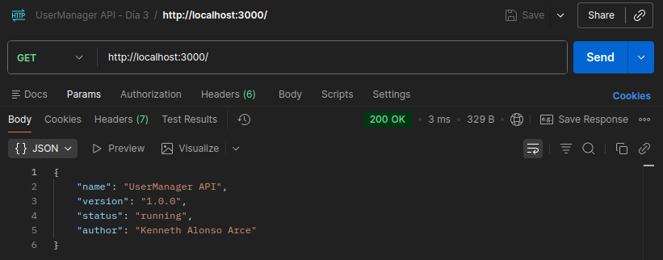
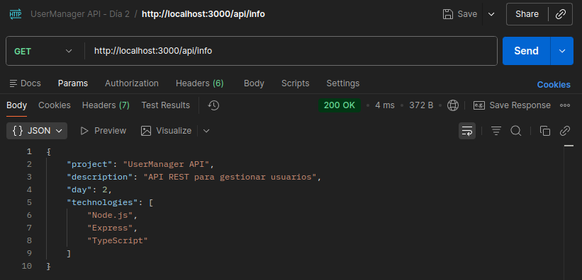

# Día 2: Preparación del proyecto

## Qué he hecho

- He inicializado el proyecto Node.js.
- He instalado Express.
- He configurado TypeScript.
- He creado la carpeta src.
- He creado el archivo src/server.ts.
- He arrancado el servidor en local.
- He probado la respuesta desde navegador o Thunder Client.

## Comando para arrancar el proyecto

```bash
npm run dev
```

## URL de prueba

```text
http://localhost:3000
```

### Respuesta obtenida

```json
{
  "name": "UserManager API",
  "version": "1.0.0",
  "status": "running",
  "author": "Kenneth Alonso Arce"
}
```


## URL de información

```text
http://localhost:3000/api/info
```
### Respuesta obtenida
```json
{
  "project": "UserManager API",
  "description": "API REST para gestionar usuarios",
  "day": 2,
  "technologies": [
    "Node.js",
    "Express",
    "TypeScript"
  ]
}
```


## Explicación personal

Para entender cómo funciona el código que hemos montado hoy, imagina que estamos abriendo una tienda física:

* **¿Qué hace el archivo `src/server.ts`?**
  Es el centro de operaciones o el "cerebro" de nuestro servidor. Es el archivo principal donde reunimos todas las herramientas (como Express), configuramos las reglas básicas y definimos cómo va a arrancar nuestra aplicación. Todo el backend empieza aquí.

* **¿Qué hace `app.listen`?**
  Es el equivalente a abrir las puertas de la tienda y colgar el cartel de *Abierto*. Le dice a nuestro servidor que se quede encendido de forma constante, atento y "escuchando" en un número de puerto específico (el 3000) por si llega algún cliente a pedir algo.

* **¿Qué hace `app.get`?**
  Es una regla que define qué hacer cuando un cliente nos visita en una dirección concreta para pedir información. Es como decirle al dependiente: *"Si alguien entra y pregunta por la ruta principal (`/`), atiéndelo y devuélvele este mensaje JSON"*.

* **¿Por qué usamos `express.json`?**
  Es nuestro traductor automático. Por defecto, cuando un cliente envía datos complejos al servidor, Express no sabe leerlos y los recibe como un bloque de texto plano sin sentido. Esta línea actúa como un filtro que traduce esos datos al formato JSON para que el servidor pueda entenderlos y trabajar con ellos perfectamente.

## Pruebas de errores

### Prueba 1: Acceder a un puerto incorrecto
Si accedemos a otro puerto distinto, por ejemplo **`GET localhost:3001/api/info`**, aparece el error **`Error: connect ECONNREFUSED 127.0.0.1:3001`** indicando que en el puerto 3001 no tenemos ningún servidor escuchando. 

Pasa lo mismo si queremos acceder a cualquier ruta de **`GET localhost:3001`**.


### Prueba 2: Escribir mal una ruta
Si accedemos a una ruta incorrecta, por ejemplo **`GET localhost:3000/api/inf`**, aparece el error **`Cannot GET /api/inf`**.

Este error es una página preconfigurada por Express en HTML:
```html
<!DOCTYPE html>
<html lang="en">

<head>
    <meta charset="utf-8">
    <title>Error</title>
</head>

<body>
    <pre>Cannot GET /api/inf</pre>
</body>

</html>
```

### Prueba 3: Borrar temporalmente una importación
Si borramos temporalmente la importación de express en src/server.ts, el error aparece en el momento de crear el servidor.

La terminal nos devuelve el error **`ReferenceError: express is not defined`**, indicando que  el código intenta ejecutar la función express() en la línea siguiente, pero como hemos eliminado la importación, el programa ya no sabe qué significa esa palabra ni qué herramienta debe utilizar.