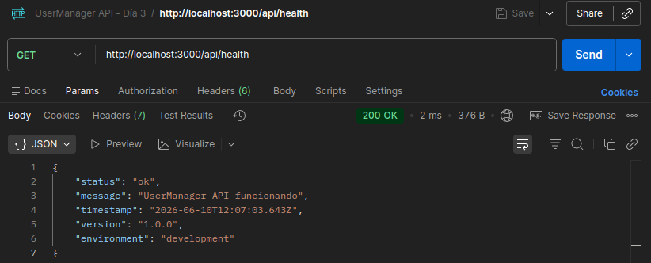
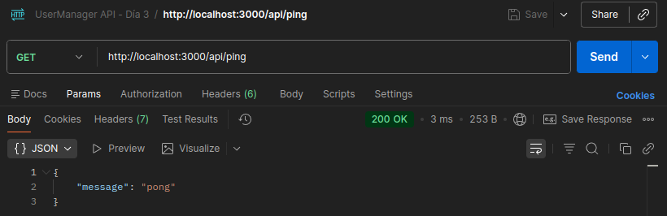

# Día 3: Primer endpoint

## Qué he hecho

- He creado el endpoint `GET /api/health`.
- He creado el endpoint `GET /api/ping`.
- He devuelto una respuesta JSON.
- He usado el status code `200`.
- He probado la ruta desde navegador.
- He probado la ruta desde Thunder Client o Postman.
- He probado una ruta incorrecta para comprobar qué ocurre.

## Endpoints creados
### Endpoint Health

```http
GET /api/health
```

### Respuesta obtenida

```json
{
  "status": "ok",
  "message": "UserManager API funcionando",
  "timestamp": "2026-06-10T12:07:03.643Z",
  "version": "1.0.0",
  "environment": "development"
}
```
---
### Endpoint Ping

```http
GET /api/ping
```

### Respuesta obtenida

```json
{
  "message": "pong"
}
```

## Explicación personal

El endpoint `/api/health` sirve para comprobar que la API está funcionando correctamente. Cuando recibe una petición `GET`, devuelve un JSON con el estado de la aplicación.

## Comparación rutas
| Ruta | Método | Para qué sirve |
| :--- | :--- | :--- |
| `/` | `GET` | Mensaje inicial de la API |
| `/api/health` | `GET` | Comprobar el estado de la API |
| `/api/info` | `GET` | Comprobar la información de la API |
| `/api/ping` | `GET` | Comprobar respuesta rápida del servidor |

## Pruebas realizadas
| Petición | Código esperado | Resultado obtenido |
| :--- | :--- | :--- |
| `GET /` | `200` | Mensaje del servidor con el nombre, la versión, el estado y el autor |
| `GET /api/health` | `200` | Mensaje del servidor con el estado, el timestamp de la consulta, la versión y el entorno de desarrollo |
| `GET /api/ping` | `200` | Mensaje rápido de respuesta |

### Prueba con POSTMAN - GET http://localhost:3000/


### Prueba con POSTMAN - GET http://localhost:3000/api/health


### Prueba con POSTMAN - GET http://localhost:3000/api/ping
