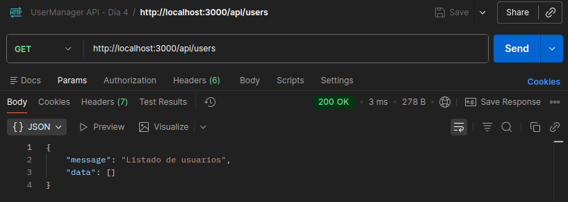
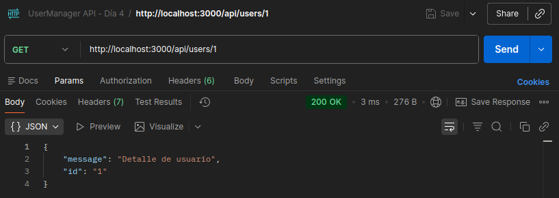
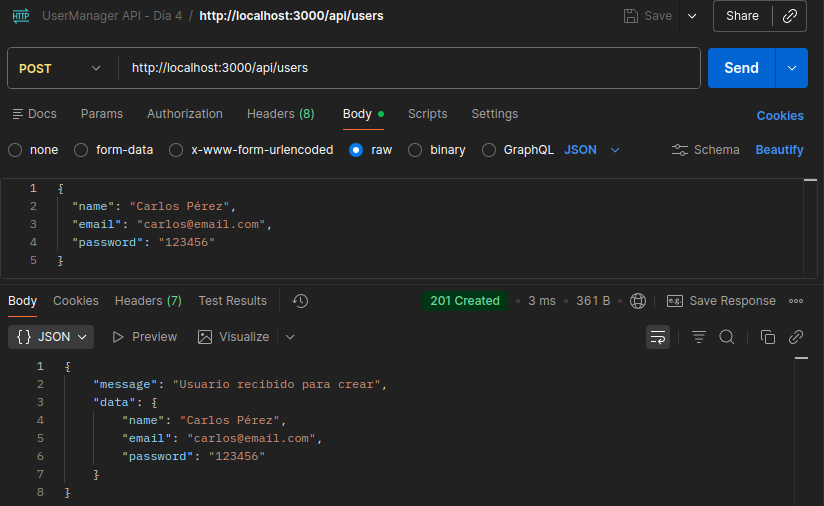
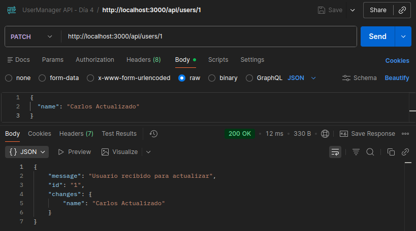
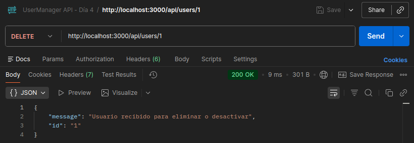
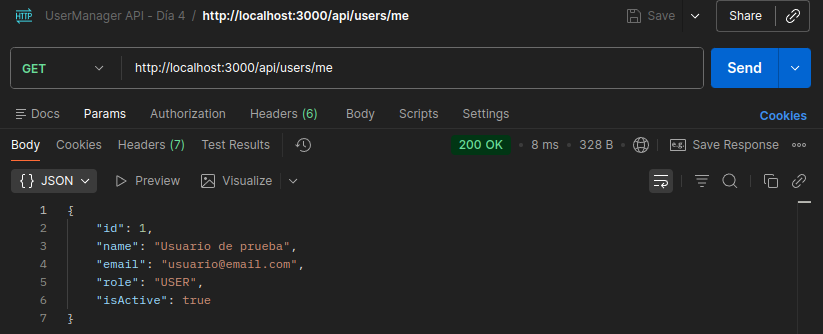
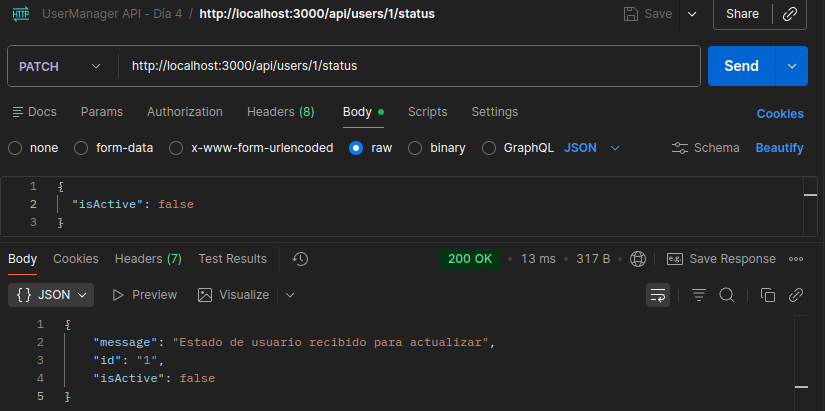
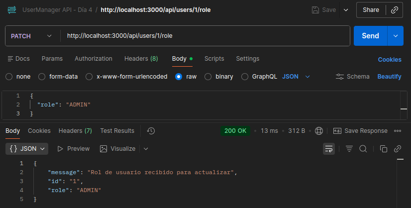

# Día 4: Métodos HTTP

## Qué he hecho

- He creado rutas simuladas para usuarios.
- He probado `GET /api/users`.
- He probado `GET /api/users/:id`.
- He probado `POST /api/users` enviando JSON.
- He probado `PATCH /api/users/:id` enviando JSON.
- He probado `DELETE /api/users/:id`.
- He probado `GET /api/users/me`.
- He probado `PATCH /api/users/:id/status` enviando JSON.
- He probado `PATCH /api/users/:id/role` enviando JSON.
- He creado una colección de pruebas en Thunder Client o Postman.

## Endpoints trabajados

```http
GET /api/users
GET /api/users/:id
POST /api/users
PATCH /api/users/:id
DELETE /api/users/:id
```

## Explicación personal

GET sirve para obtener información.
POST sirve para crear información.
PATCH sirve para modificar parte de un recurso.
DELETE sirve para eliminar o desactivar un recurso.

## Comparación rutas
| Petición | Método | Código esperado | Resultado obtenido |
| :--- | :--- | :--- | :--- |
| `/api/users` | `GET` | `200` | Listado de todos los usuarios |
| `/api/users/1` | `GET` | `200` | Detalle del usuario con id 1 |
| `/api/users` | `POST` | `201` | Mensaje de confirmación del servidor con los datos recibidos para crear un usuario nuevo |
| `/api/users/1` | `PATCH` | `200` | Mensaje de confirmación del servidor con los datos recibidos para modificar el usuario con id 1 |
| `/api/users/1` | `DELETE` | `200` | Mensaje de confirmación del servidor para eliminar o desactivar el usuario con id 1 |
| `/api/users/me` | `GET` | `200` | Detalle del usuario conectado |
| `/api/users/1/status` | `PATCH` | `200` | Mensaje de confirmación del servidor con los datos para cambiar el estado del usuario con id 1 |
| `/api/users/:id/role` | `PATCH` | `200` | Mensaje de confirmación del servidor con los datos para cambiar el rol del usuario con id 1 |

### Prueba con POSTMAN - GET http://localhost:3000/api/users


### Prueba con POSTMAN - GET http://localhost:3000/api/users/1


### Prueba con POSTMAN - POST http://localhost:3000/api/users/


### Prueba con POSTMAN - PATCH http://localhost:3000/api/users/1


### Prueba con POSTMAN - DELETE http://localhost:3000/api/users/1


### Prueba con POSTMAN - GET http://localhost:3000/api/users/me


### Prueba con POSTMAN - PATCH http://localhost:3000/api/users/1/status


### Prueba con POSTMAN - PATCH http://localhost:3000/api/users/1/role


## Usos de los métodos HTTP
| Método | ¿Para qué sirve? | Ejemplo en UserManager API |
| :--- | :--- | :--- |
| `GET` | Para consultar datos al servidor | Podemos ver la lista completa de los usuarios o el detalle de cada uno |
| `POST` | Para crear entradas nuevas en la base de datos | Podemos enviar los datos al servidor para crear usuarios nuevos |
| `PATCH` | Para modificar entradas existentes en la base de datos | Podemos enviar datos al servidor para modificar usuarios existentes |
| `DELETE` | Para borrar entradas en la base de datos | Podemos enviar al servidor un id de un usuario para eliminarlo o desactivarlo |