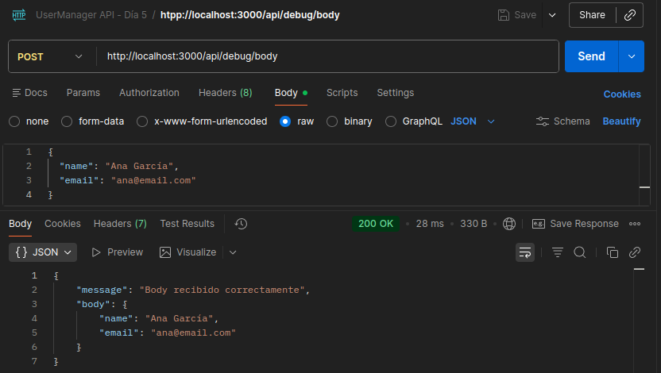
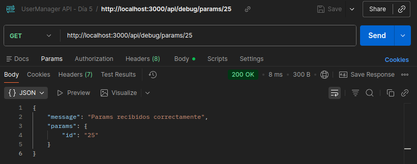
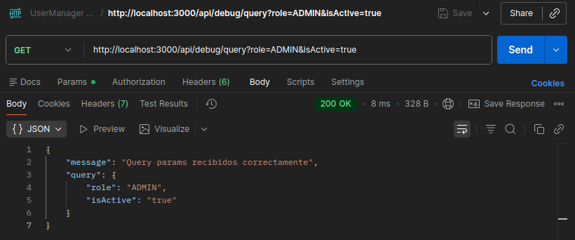
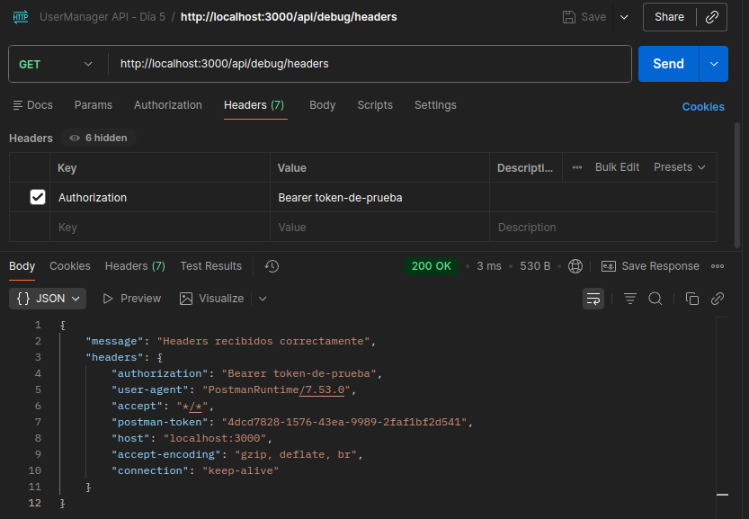
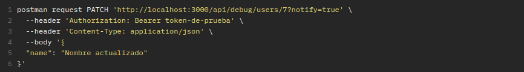
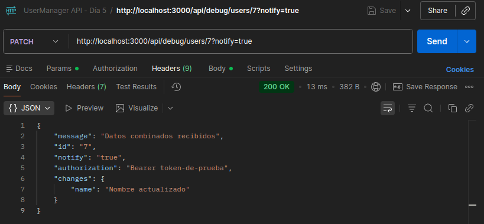
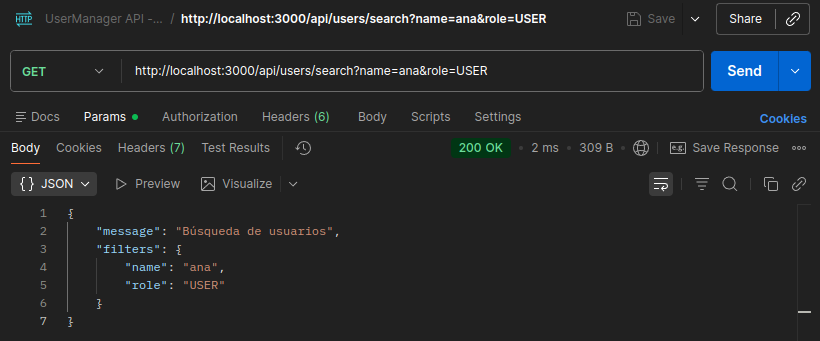
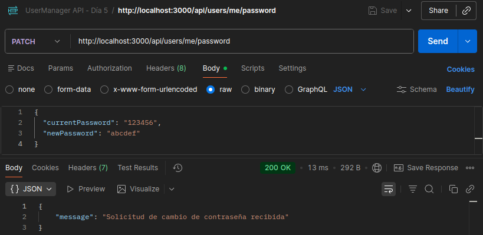
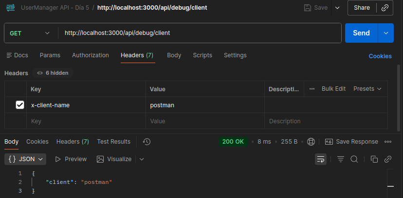

# Día 5: JSON, body, params y headers

## Qué he hecho

- He repasado qué es JSON.
- He aprendido para qué sirve el body.
- He probado route params.
- He probado query params.
- He probado headers.
- He creado rutas temporales de debug.
- He creado una colección de pruebas en Thunder Client o Postman.

## Rutas trabajadas

```http
POST /api/debug/body
GET /api/debug/params/:id
GET /api/debug/query
GET /api/debug/headers
PATCH /api/debug/users/:id
```

## Explicación personal

El body sirve para enviar datos principales al servidor.
Los params sirven para identificar recursos concretos en la ruta.
Los query params sirven para enviar filtros u opciones en la URL.
Los headers sirven para enviar información adicional de la petición.

## Tabla de pruebas realizadas
| Petición | Dato probado | Código esperado | Resultado obtenido |
| :--- | :--- | :--- | :--- |
| `POST /api/debug/body` | Body | `200` | Mensaje de confirmación de recepción del body con los datos del body |
| `GET /api/debug/params/25` | Params | `200` | Mensaje de confirmación de recepción de los params con los datos de los params |
| `GET /api/debug/query?role=ADMIN&isActive=true` | Query | `200` | Mensaje de confirmación de recepción de la query con los datos de la query |
| `GET /api/debug/headers` | Headers | `200` | Mensaje de confirmación de recepción de los headers con los datos de los headers |
| `PATCH /api/debug/users/7?notify=true` | Combinado | `200` | Mensaje de confirmación del recepción con los datos del body, los params, la query y los headers |
| `GET /api/users/search?name=ana&role=USER` | Query | `200` | Mensaje de búsqueda con los filtros aplicados |
| `PATCH /api/users/me/password` | Body | `200` | Mensaje de confirmación de datos recibidos para cambiar la contraseña. Los datos no se muestras pero se guardan como constantes en el endpoint |
| `GET /api/debug/client` | Headers | `200` | Mensaje con el header del cliente |

### Prueba con POSTMAN - POST http://localhost:3000/api/debug/body


### Prueba con POSTMAN - GET http://localhost:3000/api/debug/params/25


### Prueba con POSTMAN - GET http://localhost:3000/api/debug/query?role=ADMIN&isActive=true


### Prueba con POSTMAN - GET http://localhost:3000/api/debug/headers


### Prueba con POSTMAN - PATCH http://localhost:3000/api/debug/users/7?notify=true



### Prueba con POSTMAN - GET http://localhost:3000/api/debug/headers


### Prueba con POSTMAN - PATCH http://localhost:3000/api/users/me/password


### Prueba con POSTMAN - GET http://localhost:3000/api/debug/client


## ¿Dónde viaja cada dato?
| Dato | ¿Dónde viajaría? | Ejemplo en UserManager API |
| :--- | :--- | :--- |
| ID de usuario | Params | `GET http://localhost:3000/api/users/1` |
| Email de registro | Body | `POST http://localhost:3000/api/users` |
| Filtro por rol | Query | `GET http://localhost:3000/api/debug/query?role=ADMIN&isActive=true` |
| Token JWT | Header | `GET http://localhost:3000/api/debug/headers` |
| Nueva contraseña | Body | `PATCH http://localhost:3000/api/users/me/password` |