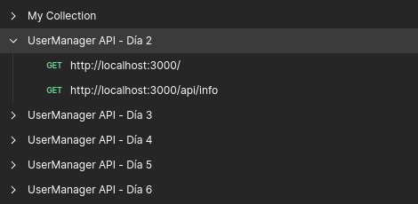
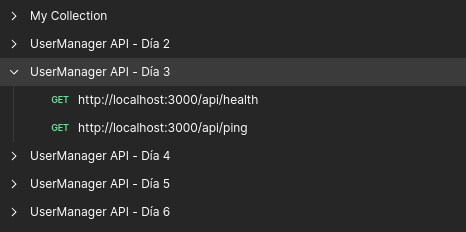
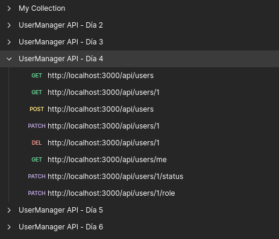
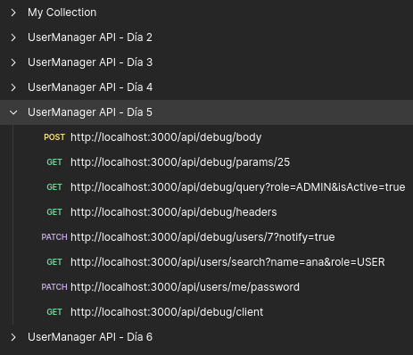
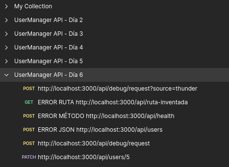
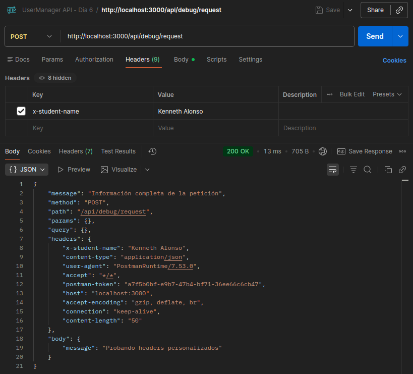
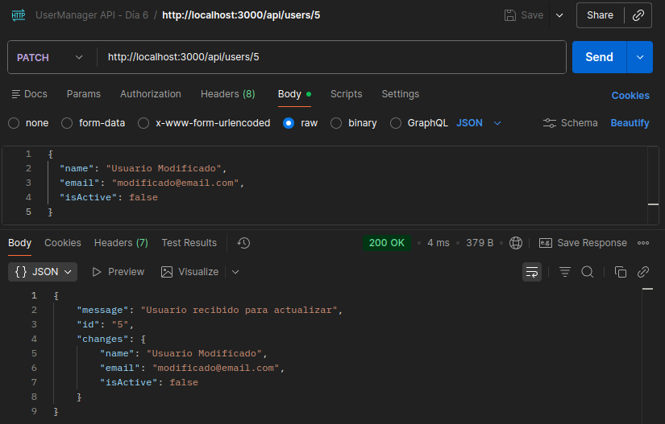

# Día 6: Cliente HTTP y depuración

## Qué he hecho

- He organizado una colección de pruebas de la API.
- He probado rutas básicas.
- He probado peticiones con body.
- He probado peticiones con params, query params y headers.
- He creado una ruta temporal de depuración.
- He provocado errores controlados para entender qué ocurre.
- He revisado respuestas y códigos de estado.

## Colecciones creadas

Nombre de la colección:

```text
UserManager API - Día 2
```

```text
UserManager API - Día 3
```

```text
UserManager API - Día 4
```

```text
UserManager API - Día 5
```

```text
UserManager API - Día 6
```

## Ruta temporal de depuración

```http
POST /api/debug/request
```

## Explicación personal

Un cliente HTTP sirve para enviar peticiones a una API y analizar las
respuestas. Es útil porque permite probar métodos, headers, body, params y
códigos de estado de una forma más completa que el navegador.

## Tabla de pruebas realizadas
| Petición | ¿Qué prueba? | Código esperado | Código obtenido | Observaciones |
| :--- | :--- | :--- | :--- | :--- |
| `GET /api/health` | Health endpoint | `200` | `200` | Ruta para comprobar si el servidor está encendido y a la espera |
| `GET /api/users` | Listado simulado | `200` | `200` | Ruta con lista vacía de usuarios |
| `POST /api/users` | Body JSON | `201` | `201` | Ruta para simular la creación de un nuevo usuario con un JSON en el body de la request |
| `PATCH /api/users/1` | Params + Body | `200` | `200` | Ruta para modificar un usuario existente identificado con los Params y con un JSON en el body de la request |
| `POST /api/debug/request?source=thunder` | Request completa |`200` | `200` | Request de depuración para comprobar todos los componentes de una petición HTTP |
| `GET /api/ruta-inventada` | Ruta inexistente | `404` | `404` | Devuelve un error 404 básico ya que aún no tenemos un middleware |
| `POST /api/health` | Método incorrecto | `404` | `404` | Devuelve un error 404 básico ya que aún no tenemos un middleware |

## Prueba de headers personalizados

El header aparece en el apartado de headers, en primera posición. Lo marcamos con una "x" al inicio para indicar que es un header personalizado.

## Prueba de actualización completa

La id del usuario (5) viaja a través de los params de la ruta. Los parámetros que queremos modificar (nombre, email y isActive) viaja a través del body. La API devuelve un mensaje de confirmación con los datos recibidos y el ID del usuario a modificar.

## Mi guía para depurar una petición
- Comporbar el servidor
- Revisar Método y URL
- Revisar headers (`Content-Type: application/json`)
- Revisar el Body
- Mirar los logs de la terminal
- Mirar el Status Code
- Revisar el body de la respuesta

## Comparación entre navegador y cliente HTTP
| Herramienta | Ventajas | Limitaciones |
| :--- | :--- | :--- |
| Navegador | Renderiza interfaces (HTML/CSS/JS). Es ideal y rápido para probar peticiones GET. | Muy complicado probar POST, PUT o DELETE sin programar un frontend. Modificar headers (como tokens de autorización) es engorroso. |
| Cliente HTTP | Control absoluto de la petición. Soporta todos los métodos HTTP. Permite manipular headers, querys y enviar el body (JSON) fácilmente. Guarda el historial. | No sirve para ver el resultado visual de una página web, ya que no renderiza la interfaz. Solo muestra los datos crudos o el código fuente. |