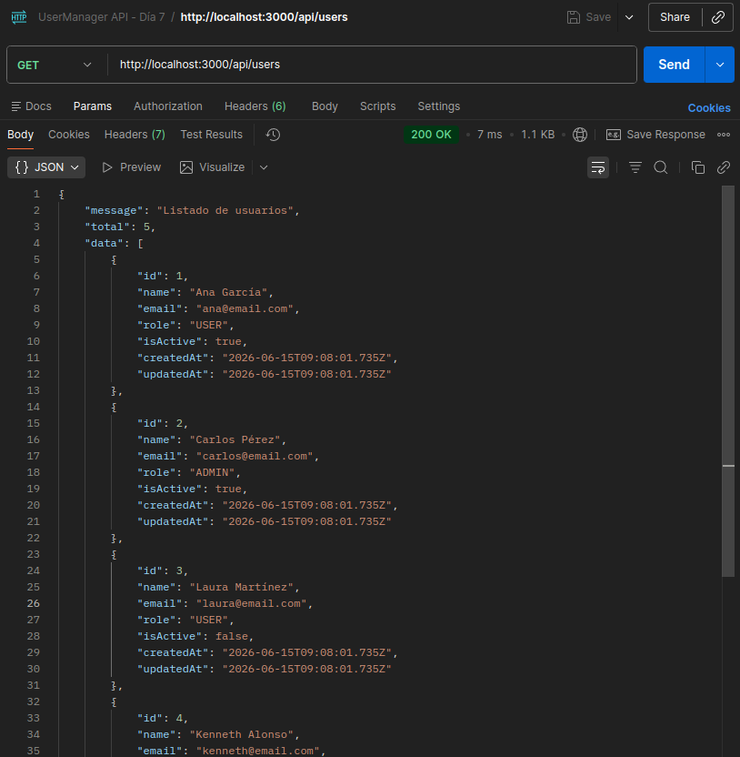

# Día 7: Listado de usuarios en memoria

## Qué he hecho

- He creado un tipo User en TypeScript.
- He creado un array de usuarios en memoria.
- He actualizado el endpoint GET /api/users.
- He devuelto un listado de usuarios en formato JSON.
- He añadido el total de usuarios en la respuesta.
- He comprobado que no se devuelven contraseñas.
- He creado un endpoint de conteo de usuarios `GET /api/users/count`

## Endpoint trabajado
### GET /api/users

```http
GET /api/users
```

#### Respuesta obtenida

```json
{
    "message": "Listado de usuarios",
    "total": 5,
    "data": [
        {
            "id": 1,
            "name": "Ana García",
            "email": "ana@email.com",
            "role": "USER",
            "isActive": true,
            "createdAt": "2026-06-15T09:08:01.735Z",
            "updatedAt": "2026-06-15T09:08:01.735Z"
        },
        {
            "id": 2,
            "name": "Carlos Pérez",
            "email": "carlos@email.com",
            "role": "ADMIN",
            "isActive": true,
            "createdAt": "2026-06-15T09:08:01.735Z",
            "updatedAt": "2026-06-15T09:08:01.735Z"
        },
        {
            "id": 3,
            "name": "Laura Martínez",
            "email": "laura@email.com",
            "role": "USER",
            "isActive": false,
            "createdAt": "2026-06-15T09:08:01.735Z",
            "updatedAt": "2026-06-15T09:08:01.735Z"
        },
        {
            "id": 4,
            "name": "Kenneth Alonso",
            "email": "kenneth@email.com",
            "role": "ADMIN",
            "isActive": true,
            "createdAt": "2026-06-15T09:08:01.735Z",
            "updatedAt": "2026-06-15T09:08:01.735Z"
        },
        {
            "id": 5,
            "name": "Sara Gómez",
            "email": "sara@email.com",
            "role": "USER",
            "isActive": false,
            "createdAt": "2026-06-15T09:08:01.735Z",
            "updatedAt": "2026-06-15T09:08:01.735Z"
        }
    ]
}
```

### GET /api/users/count

```http
GET /api/users/count
```

#### Respuesta obtenida

```json
{
    "total": 5
}
```
---
## Explicación personal

Trabajar en memoria significa que los datos están guardados temporalmente
mientras el servidor está encendido. Si reinicio el servidor, los datos vuelven
al estado inicial.

## Tabla de comprobación
| Comprobación | Resultado |
| :--- | :--- |
| La ruta `GET /api/users`responde | ✅ |
| El status code es 200 | ✅ |
| La respuesta contiene `message` | ✅ |
| La respuesta contiene `total` | ✅ |
| La respuesta contiene `data` | ✅ |
| `data` es un array | ✅ |
| Los usuarios no incluyen contraseña | ✅ |

### Prueba con POSTMAN - GET http://localhost:3000/api/users


## Memoria vs base de datos
### ¿Qué significa guardar datos en memoria?
Básicamente, significa que estamos almacenando la información de la API directamente en la memoria RAM del servidor donde se está ejecutando la aplicación.

A nivel de código, como estamos desarrollando en TypeScript, esto se traduce en guardar la información en estructuras de datos temporales, como por ejemplo un Array de objetos. Mientras el servidor esté en marcha, podemos añadir, leer, modificar y borrar datos de ese array (CRUD) sin ningún problema y de forma casi instantánea.

### ¿Qué problema tiene?
El problema fundamental es la volatilidad.

La memoria RAM es un almacenamiento temporal vinculado a la vida del proceso de la aplicación. Si detengo la ejecución de la API para hacer un cambio en el código, si el servidor se reinicia, o si ocurre un error inesperado y el programa se cae, todos los datos se pierden instantáneamente.

Es como escribir en una pizarra: es rápido y cómodo para trabajar en el momento y comprobar que la lógica funciona, pero en cuanto apagas la luz, se borra todo.

### ¿Por qué más adelante necesitaré una base de datos?
Cuando la API esté lista para dejar de ser una prueba y convertirse en un proyecto real, necesitaremos dar el salto a una base de datos por dos motivos principales:

- Persistencia: Es el concepto clave para que la aplicación sea útil. Necesitamos que la información se guarde de forma permanente en un almacenamiento físico (disco duro). De esta forma, aunque la API se reinicie por una actualización o un fallo, cuando vuelva a arrancar leerá la base de datos y toda la información de los usuarios o productos seguirá ahí.

- Eficiencia en consultas complejas: Buscar o filtrar información en arrays de memoria utilizando métodos como .filter() o .find() es ineficiente cuando empiezas a tener miles de registros. Las bases de datos están diseñadas y optimizadas específicamente para hacer consultas complejas, relacionar datos y devolver la información de manera inmediata.

En resumen: Trabajar en memoria ahora mismo es el "modo borrador" para construir la lógica del CRUD rápido. Pero para que el sistema sea viable y permanente, el paso final indispensable será conectar la API a una base de datos real.