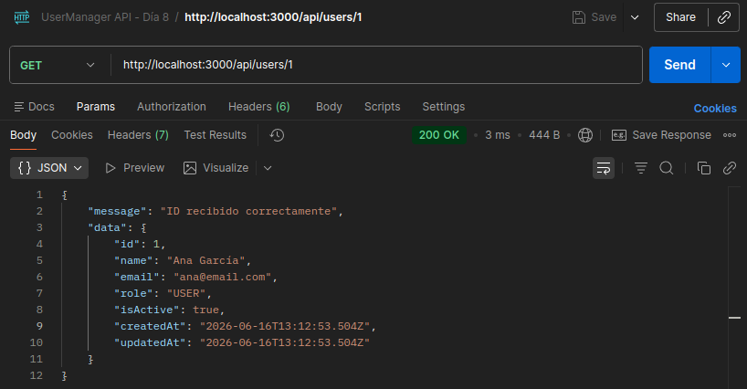
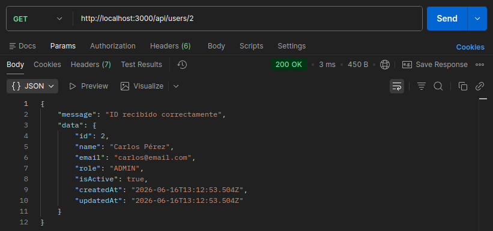
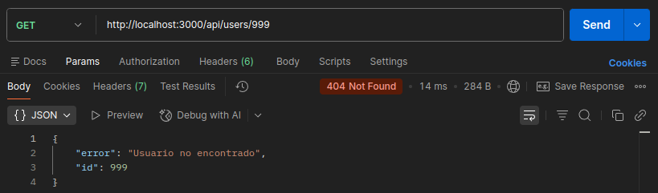
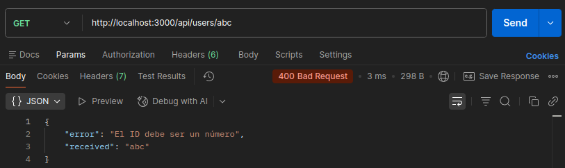
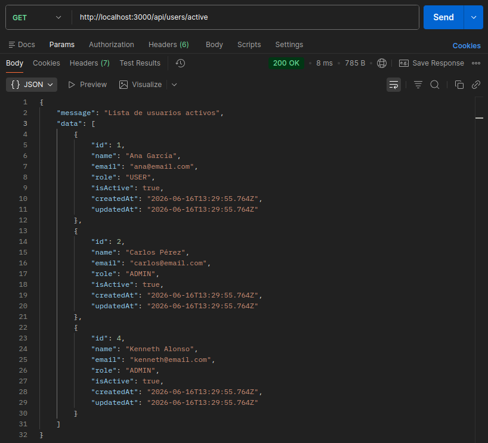
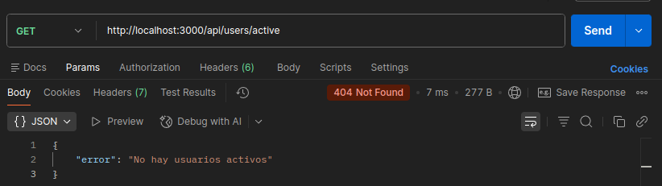

# Día 8: Consultar usuario por ID

## Qué he hecho

- He actualizado el endpoint `GET /api/users/:id`.
- He leído el ID desde `req.params`.
- He convertido el ID de string a number.
- He validado si el ID es numérico.
- He buscado usuarios con `find`.
- He devuelto `404` cuando el usuario no existe.
- He probado diferentes casos desde Postman.

## Endpoint trabajado

```http
GET /api/users/:id
```

## Casos probados

| Petición | Código esperado | Resultado |
| --- | ---: | --- |
| `GET /api/users/1` | 200 | Usuario encontrado |
| `GET /api/users/2` | 200 | Usuario encontrado |
| `GET /api/users/999` | 404 | Usuario no encontrado |
| `GET /api/users/abc` | 400 | ID no válido |
| `GET /api/users/active` | 200 | Lista de usuarios activos |
| `GET /api/users/active` (Lista vacía) | 404 | No hay usuarios activos |









## Explicación personal

El parámetro `:id` se recibe desde `req.params`. Como llega en formato string,
hay que convertirlo a number antes de compararlo con los id de los usuarios.

## Orden de rutas en Express

En Express, las rutas se evalúan en estricto orden secuencial (de arriba a abajo, tal y como están escritas en el código).

El segmento `:id` en la ruta `/api/users/:id` es un parámetro dinámico. Esto significa que Express aceptará cualquier texto que se coloque en esa posición y lo interpretará como un identificador de usuario.

- El problema: Si colocamos `/api/users/:id` primero, cuando se haga una petición a `/api/users/count`, Express la interceptará por error pensando que la palabra "count" es el :id de un usuario.
- La solución: Para evitar que las rutas dinámicas oculten otras peticiones, las rutas estáticas y específicas (como `/count`, `/search` o `/active`) se deben definir siempre antes.