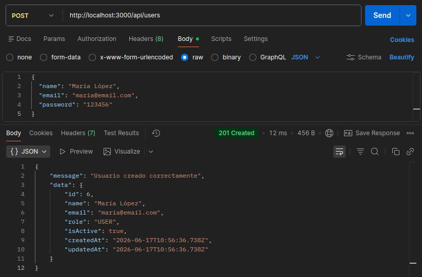
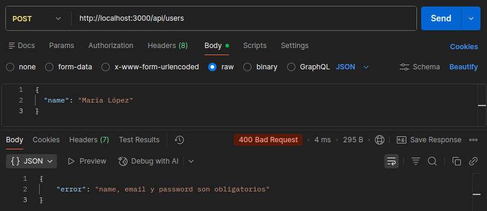
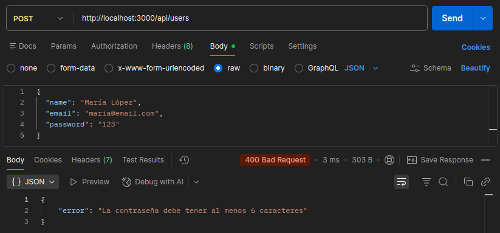
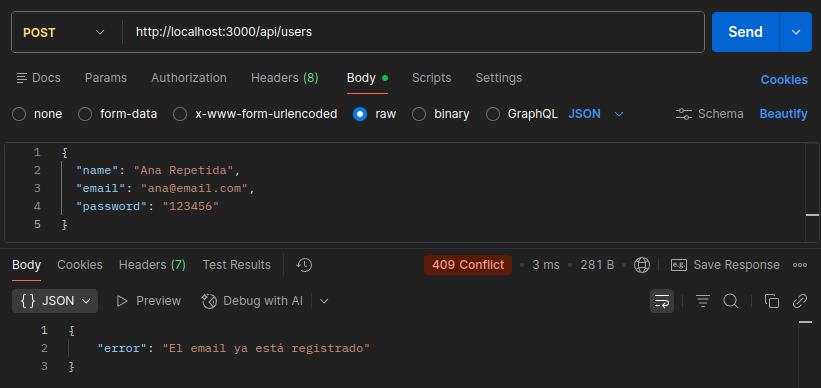
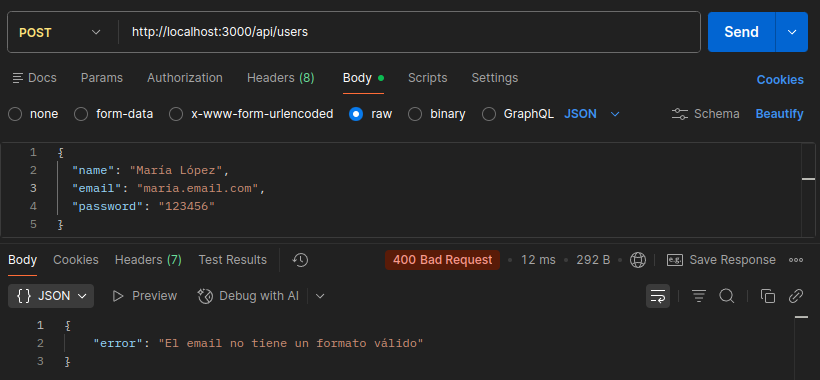

# Día 9: Crear usuarios en memoria

## Qué he hecho

- He actualizado el endpoint `POST /api/users`.
- He leído datos desde `req.body`.
- He validado campos obligatorios.
- He validado longitud mínima de contraseña.
- He comprobado email duplicado.
- He generado un nuevo ID.
- He creado un objeto `User`.
- He añadido el usuario al array con `push`.
- He devuelto `201 Created` cuando el usuario se crea correctamente.

## Endpoint trabajado

```http
POST /api/users
```

## Body de ejemplo

```json
{
  "name": "María López",
  "email": "maria@email.com",
  "password": "123456"
}
```

## Casos probados

| Caso | Código esperado | Resultado |
| --- | ---: | --- |
| Usuario correcto | 201 | Se ha creado un usuario nuevo en memoria y se ha devuelto un mensaje de confirmación |
| Faltan campos | 400 | Se ha enviado un mensaje de error indicando que faltan datos para crear el usuario |
| Password corta | 400 | Se ha enviado un mensaje de error indicando que la contraseña es demasiado corta |
| Email duplicado | 409 | Se ha enviado un mensaje de error indicando que el email utilizado para crear un nuevo usuario ya existe en otro usuario |
| Email no válido | 400 | Se ha enviado un mensaje de error indicando que el email no tiene el formato correcto |

### Prueba con POSTMAN - POST http://localhost:3000/api/users

### Prueba con POSTMAN - POST http://localhost:3000/api/users faltan datos

### Prueba con POSTMAN - POST http://localhost:3000/api/users contraseña no válida

### Prueba con POSTMAN - POST http://localhost:3000/api/users email duplicado

### Prueba con POSTMAN - POST http://localhost:3000/api/users email no válido


## Explicación personal

Para crear un usuario se leen los datos desde `req.body`, se validan, se comprueba que el email no esté repetido, se genera un nuevo id y se añade el usuario al array con `push`.

## Datos sensibles
No incluimos la contraseña en el tipo `Usuario` ni la devolvemos en la respuesta de la API por una cuestión básica de seguridad. Si lo hiciéramos, correríamos el riesgo de que alguien intercepte la conexión y pueda verla en texto claro. Además, la idea es seguir las buenas prácticas y no manejar nunca la contraseña original sin cifrar; por eso, más adelante el sistema solo guardará su hash.