# Día 10: Actualizar usuarios en memoria

## Qué he hecho

- He actualizado el endpoint `PATCH /api/users/:id`.
- He leído el ID desde `req.params`.
- He leído los cambios desde `req.body`.
- He validado que el ID sea numérico.
- He comprobado si el usuario existe.
- He validado que el body no esté vacío.
- He validado `name`, `email` e `isActive`.
- He comprobado email duplicado al actualizar.
- He actualizado `updatedAt`.
- He sustituido el usuario dentro del array.

## Endpoints trabajados


### PATCH /api/users/:id

Body de ejemplo

```json
{
  "name": "Ana Martínez"
}
```

Casos probados

| Caso | Código esperado | Resultado |
| --- | ---: | --- |
| Actualización correcta | 200 | Aparece un mensaje de confirmación con los datos del usuario actualizado y se modifica el usuario en el array de usuarios |
| ID no válido | 400 | Aparece un mensaje de error indicando que el ID no es un número |
| Usuario inexistente | 404 | Aparece un mensaje de error indicando que el usuario con la ID de los params no existe |
| Body vacío | 400 | Aparece un mensaje de error indicando que no se ha enviado ningún dato para actualizar |
| Nombre vacío | 400 | Aparece un mensaje de error indicando que se ha enviado un nombre vacío para actualizar |
| Email no válido | 400 | Aparece un mensaje de error indicando que el email no tiene el formato correcto |
| Email duplicado | 409 | Aparece un mensaje de error indicando que el email ya existe en otro usuario |
| Adjuntado `isActive` | 400 | Aparece un mensaje de error indicando que el estado de usuario se modifica en otro endpoint |
| Adjuntado `role` | 400 | Aparece un mensaje de error indicando que el rol del usuario se modifica en otro endpoint |
| Adjuntado `id` | 400 | Aparece un mensaje de error indicando que el ID del usuario no se puede modificar |

### Prueba con POSTMAN - PATCH http://localhost:3000/api/users/1
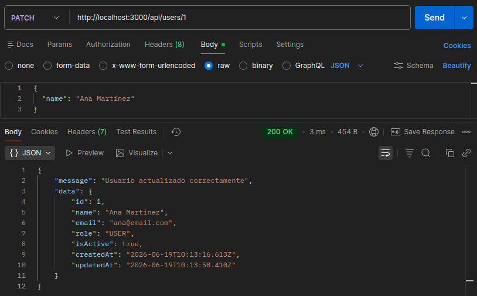
### Prueba con POSTMAN - PATCH http://localhost:3000/api/users/abc
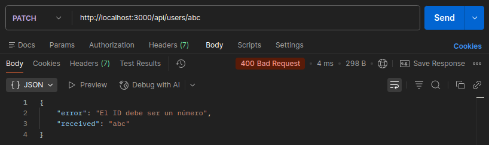
### Prueba con POSTMAN - PATCH http://localhost:3000/api/users/999
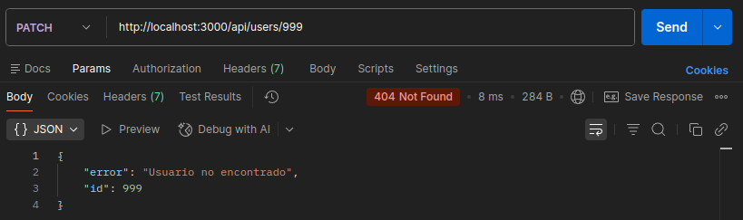
### Prueba con POSTMAN - PATCH http://localhost:3000/api/users/1 body vacío
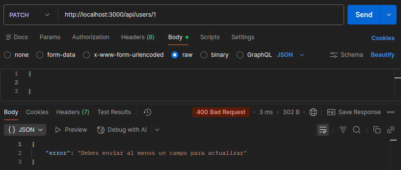
### Prueba con POSTMAN - PATCH http://localhost:3000/api/users/1 nombre vacío
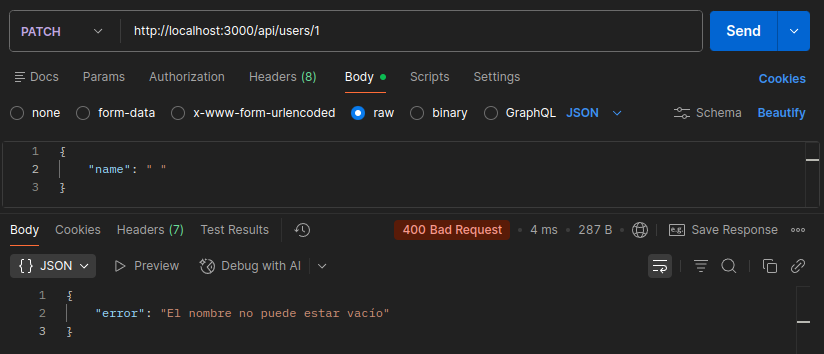
### Prueba con POSTMAN - PATCH http://localhost:3000/api/users/1 email no válido
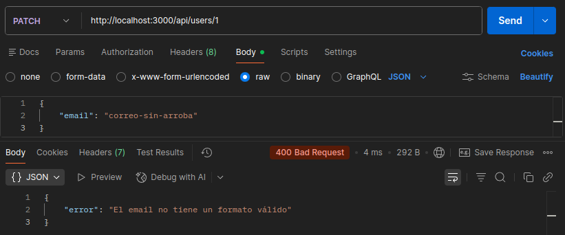
### Prueba con POSTMAN - PATCH http://localhost:3000/api/users/1 email duplicado
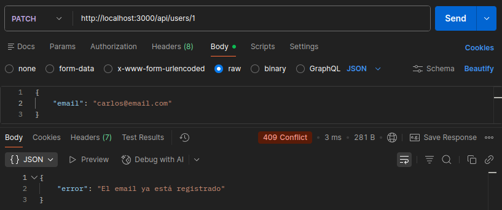
### Prueba con POSTMAN - PATCH http://localhost:3000/api/users/1 adjuntado isActive
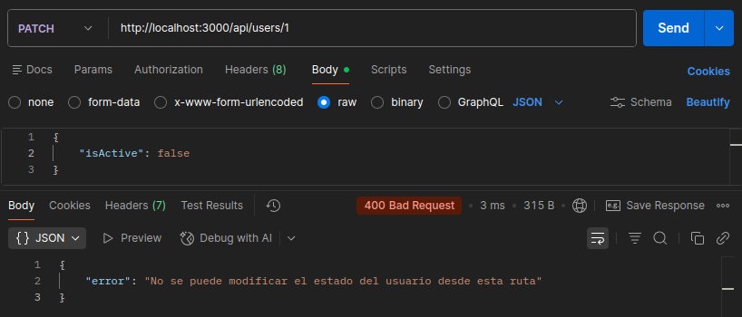
### Prueba con POSTMAN - PATCH http://localhost:3000/api/users/1 adjuntado role
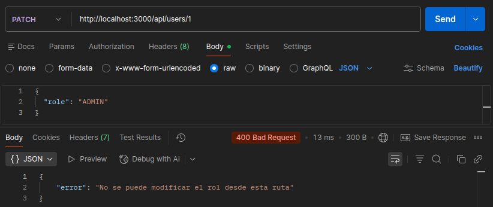
### Prueba con POSTMAN - PATCH http://localhost:3000/api/users/1 adjuntado id
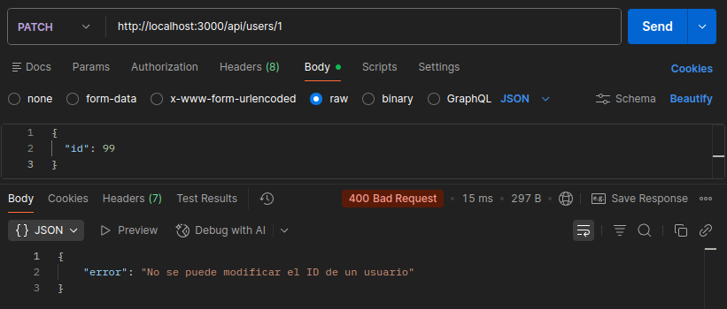

### PATCH /api/users/:id/status

Body de ejemplo

```json
{
  "isActive": false
}
```

Casos probados

| Caso | Código esperado | Resultado |
| --- | ---: | --- |
| Actualización correcta | 200 | Aparece un mensaje de confirmación con los datos del usuario actualizado y se modifica el usuario en el array de usuarios |
| ID no válido | 400 | Aparece un mensaje de error indicando que el ID no es un número |
| Usuario inexistente | 404 | Aparece un mensaje de error indicando que el usuario con la ID de los params no existe |
| `isActive` incorrecto | 400 | Aparece un mensaje de error indicando que el valor de `isActive` debe ser `true` o `false` |

### Prueba con POSTMAN - PATCH http://localhost:3000/api/users/1/status
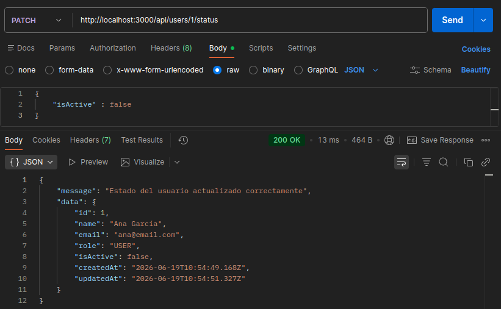
### Prueba con POSTMAN - PATCH http://localhost:3000/api/users/abc/status

### Prueba con POSTMAN - PATCH http://localhost:3000/api/users/999/status
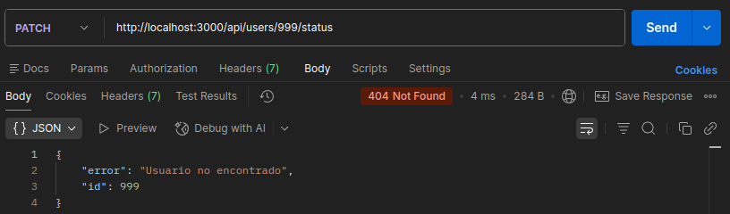
### Prueba con POSTMAN - PATCH http://localhost:3000/api/users/1/status isActive incorrecto
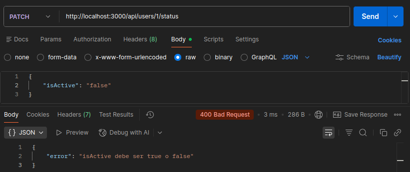

### PATCH /api/users/:id/role

Body de ejemplo

```json
{
  "role": "ADMIN"
}
```

Casos probados

| Caso | Código esperado | Resultado |
| --- | ---: | --- |
| Actualización correcta | 200 | Aparece un mensaje de confirmación con los datos del usuario actualizado y se modifica el usuario en el array de usuarios |
| ID no válido | 400 | Aparece un mensaje de error indicando que el ID no es un número |
| Usuario inexistente | 404 | Aparece un mensaje de error indicando que el usuario con la ID de los params no existe |
| `role` incorrecto | 400 | Aparece un mensaje de error indicando que el valor de `role` debe ser `"USER"` o `"ADMIN"` |

### Prueba con POSTMAN - PATCH http://localhost:3000/api/users/1/role
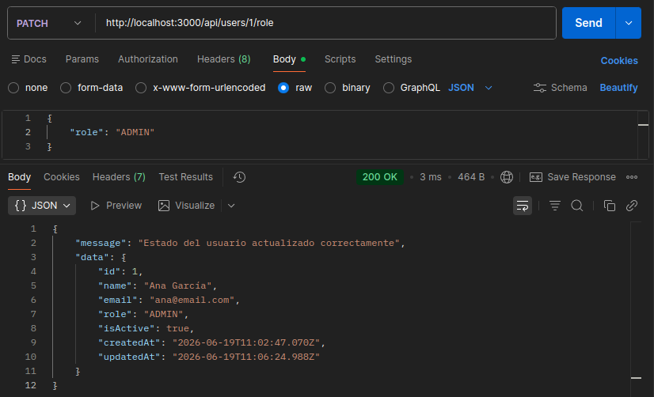
### Prueba con POSTMAN - PATCH http://localhost:3000/api/users/abc/role
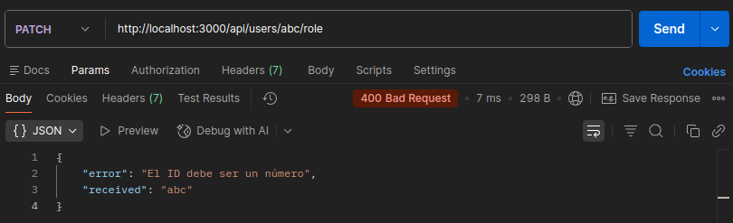
### Prueba con POSTMAN - PATCH http://localhost:3000/api/users/999/role
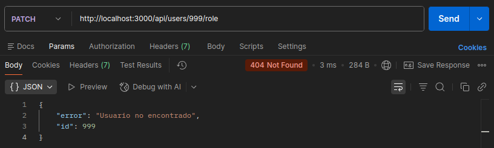
### Prueba con POSTMAN - PATCH http://localhost:3000/api/users/1/role rol incorrecto
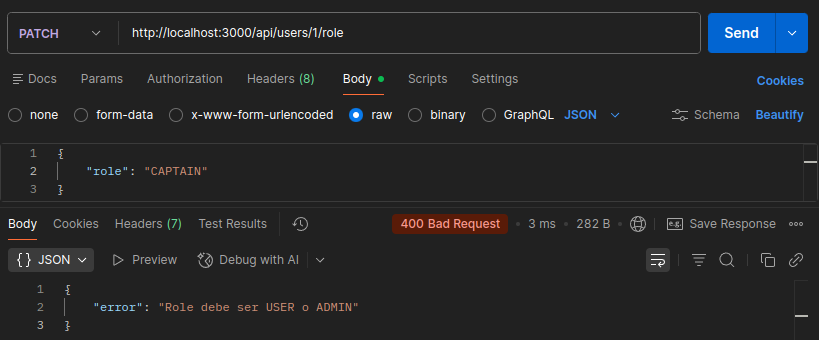

## Explicación personal

Para actualizar un usuario se lee el ID desde `req.params`, se busca el usuario en el array, se leen los cambios desde `req.body` y se sustituyen solo los campos que han llegado en la petición.

## PATCH

Actualizar parcialmente con `PATCH` significa alterar únicamente los datos que necesitas cambiar, dejando el resto intacto.

Enviar solo un campo, como por ejemplo `name`, en lugar de todo el usuario es más eficiente y evita sobreescribir accidentalmente otros datos con información obsoleta.

En esta ruta bloqueamos la modificación del `id` porque es un identificador inmutable necesario para mantener la integridad de la base de datos, y restringimos el `role` y el `isActive` porque estos campos se modifican desde otras rutas específicas, lo que nos facilita la comprobación de permisos y mejora la seguridad de la API.