# Día 11 - Eliminar o desactivar usuarios en memoria

## Qué he hecho

- He actualizado el endpoint `DELETE /api/users/:id`.
- He leído el ID desde `req.params`.
- He validado que el ID sea numérico.
- He comprobado si el usuario existe.
- He aplicado borrado lógico usando `isActive = false`.
- He actualizado `updatedAt`.
- He comprobado que el usuario sigue existiendo en el listado.
- He probado casos de error.

## Endpoint trabajado

### DELETE /api/users/:id

Casos probados

| Caso | Código esperado | Resultado |
| --- | ---: | --- |
| Desactivar usuario existente | 200 | Aparece un mensaje de confirmación con los datos del usuario desactivado y se modifica el usuario en el array de usuarios |
| ID no válido | 400 | Aparece un mensaje de error indicando que el ID no es un número |
| Usuario inexistente | 404 | Aparece un mensaje de error indicando que el usuario con la ID de los params no existe |
| Consultar usuario desactivado | 200 | Aparece la información del usuario desactivado con el parámetro `isActive` en `false` |
| Consultar listado después de desactivar | 200 | Aparece la lista entera con todos los usuarios, incluyendo los que tienen el parámetro `isActive` en `false` |
| Desactivar usuario ya desactivado | 200 | Aparece un mensaje de confirmación, indicando que el usuario ya estaba desactivado |

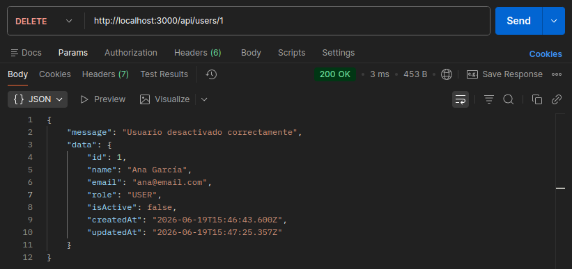
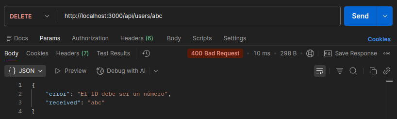
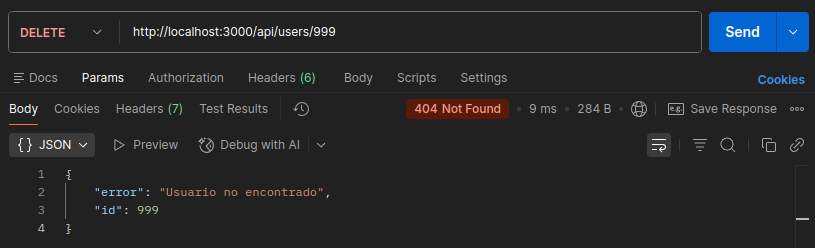
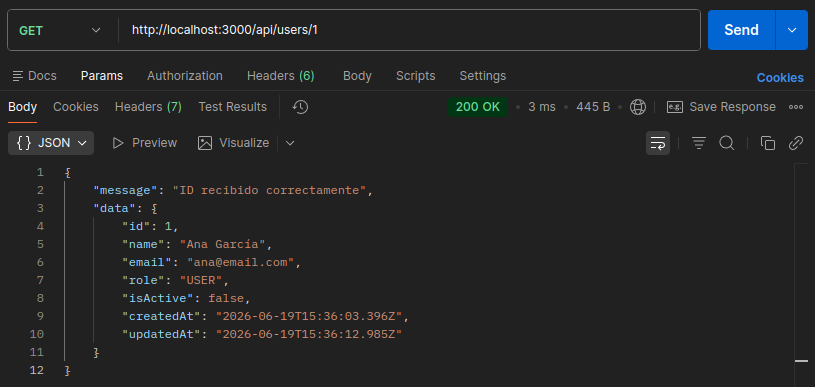
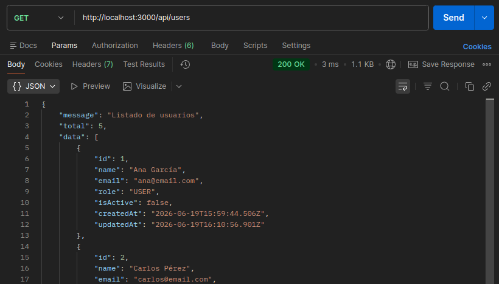
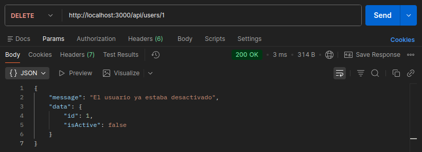

### PATCH /api/users/:id/reactivate

Casos probados

| Caso | Código esperado | Resultado |
| --- | ---: | --- |
| Reactivar usuario existente | 200 | Aparece un mensaje de confirmación con los datos del usuario activado y se modifica el usuario en el array de usuarios |
| ID no válido | 400 | Aparece un mensaje de error indicando que el ID no es un número |
| Usuario inexistente | 404 | Aparece un mensaje de error indicando que el usuario con la ID de los params no existe |
| Activar usuario ya activado | 200 | Aparece un mensaje de confirmación, indicando que el usuario ya estaba activado |

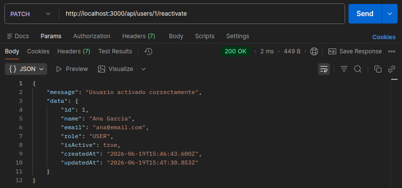
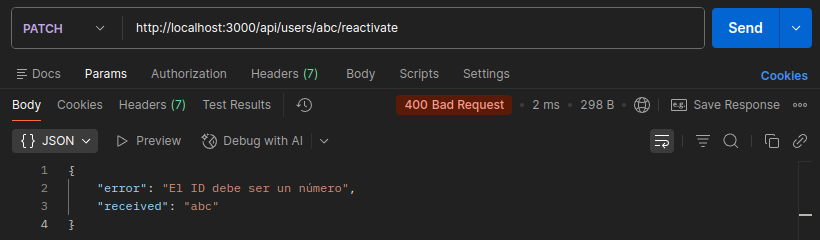
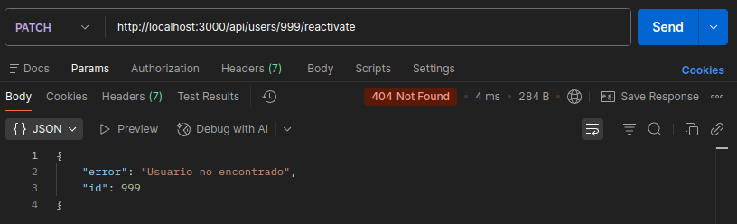
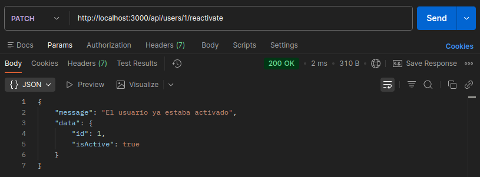

### GET /api/users/inactive

Casos probados

| Caso | Código esperado | Resultado |
| --- | ---: | --- |
| Consultar listado de usuarios inactivos | 200 | Aparece un listado con los usuarios inactivos |
| Consultar listado de usuarios inactivos cuando no hay usuarios inactivos | 404 | Aparece un mensaje de error indicando que no hay usuarios inactivos |

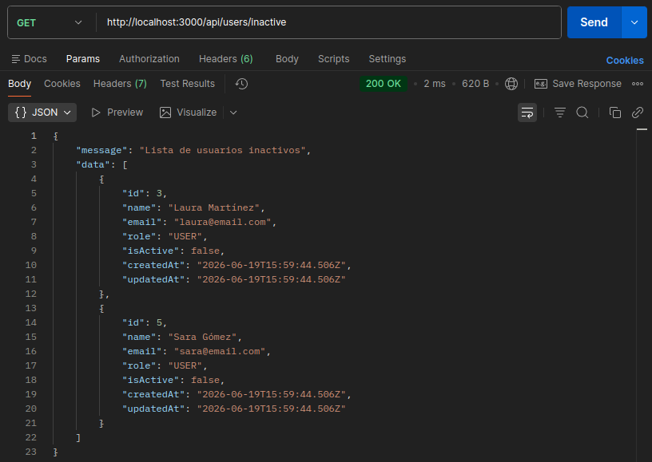
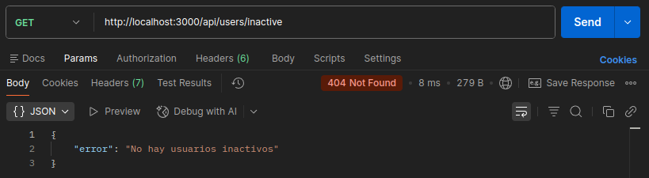

## Explicación personal

En este proyecto `DELETE` no borra físicamente el usuario. En lugar de eliminarlo del array, lo marcamos como inactivo cambiando `isActive` a `false`.
Esto se llama borrado lógico.

## Borrado físico vs Borrado lógico

La diferencia principal radica en que el borrado físico elimina de forma definitiva el registro del usuario de la base de datos, mientras que el borrado lógico consiste en desactivarlo sin suprimir su información. En este proyecto, el borrado lógico se implementa mediante el atributo `isActive = false` para preservar la integridad referencial y mantener el histórico del sistema, lo que evita la pérdida de datos y permite una futura recuperación de la cuenta si fuera necesario. Conservar al usuario en lugar de eliminarlo ofrece la gran ventaja de asegurar la consistencia de la base de datos, garantizando que no se rompan las relaciones existentes entre el usuario desactivado y cualquier otro elemento asociado en el sistema.