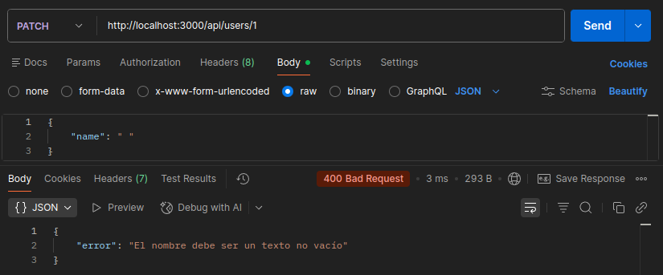
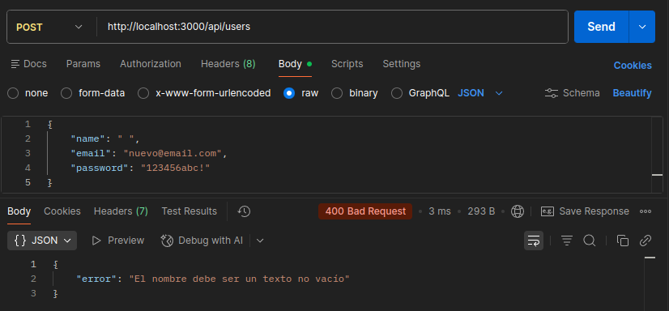
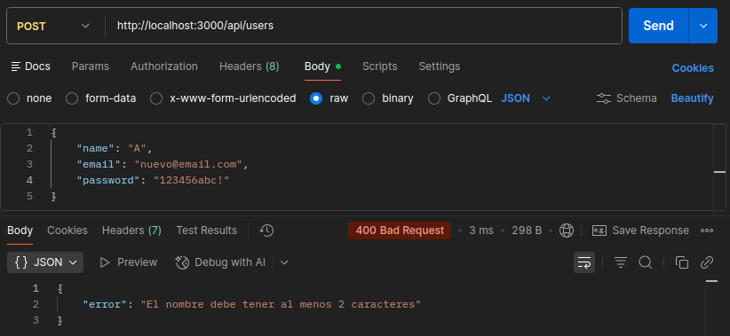
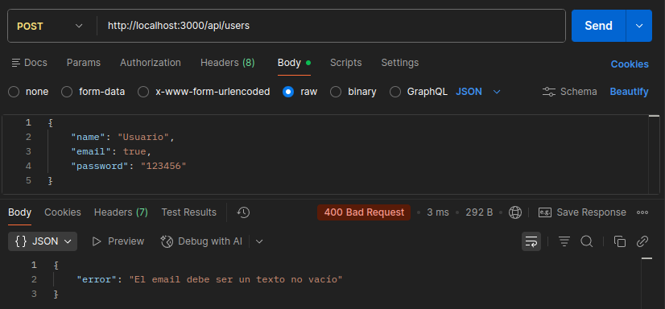
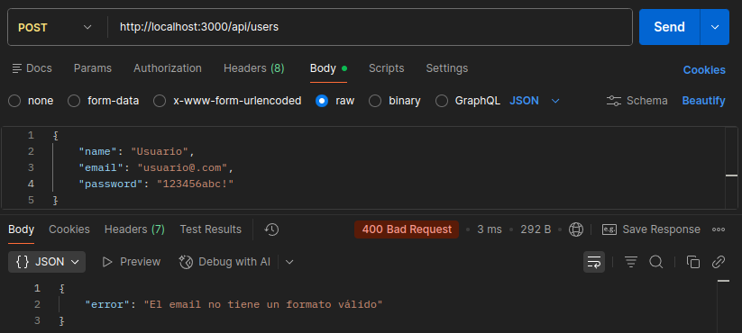
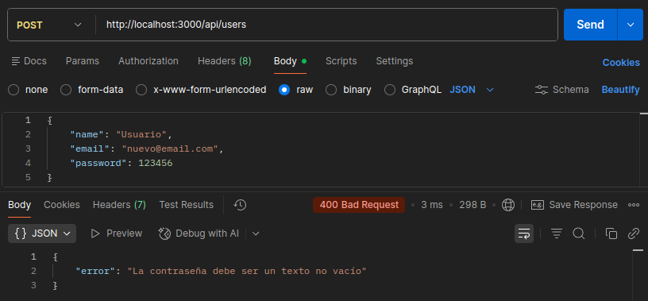
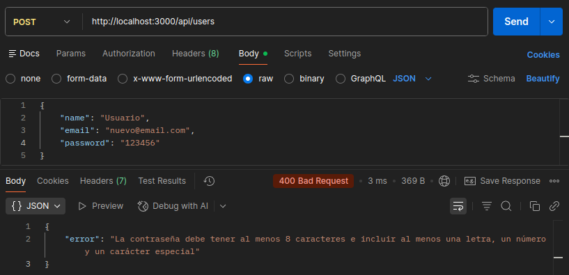
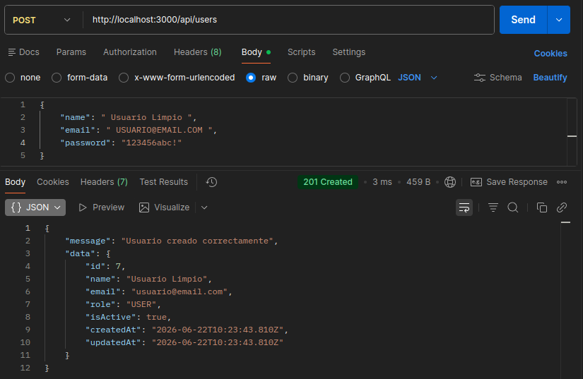
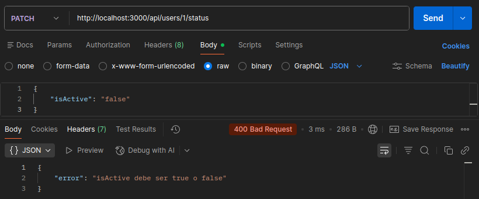

# Día 12 - Validación manual básica

## Qué he hecho

- He revisado las validaciones existentes.
- He creado funciones auxiliares de validación.
- He validado strings no vacíos.
- He validado tipos de datos.
- He limpiado `name` y `email` con `trim`.
- He normalizado `email` a minúsculas.
- He mejorado la validación de creación de usuarios.
- He mejorado la validación de actualización de usuarios.
- He probado errores `400 Bad Request`.
- He empleado expresiones regulares para validar `email` y `password`.

## Funciones creadas

```ts
function isNonEmptyString(value: unknown): value is string {
  return typeof value === "string" && value.trim().length > 0;
}

function isBoolean(value: unknown): value is Boolean {
  return typeof value === "boolean";
}

function isValidBasicName(value: string): boolean {
  return value.trim().length >= 2;
}

function isValidBasicEmail(value: string): boolean {
  const emailRegex = /^[a-zA-Z0-9.!#$%&'*+/=?^_`{|}~-]+@[a-zA-Z0-9-]+(?:\.[a-zA-Z0-9-]+)*$/;
  return emailRegex.test(value);
}

function isValidPassword(value: string): boolean {
  const regex = /^(?=.*[a-zA-Z])(?=.*\d)(?=.*[^a-zA-Z0-9]).{8,}$/;
  return regex.test(value);
}
```

## Casos probados

| Caso | Código esperado | Resultado |
| --- | ---: | --- |
| Nombre vacío | 400 | Aparece un mensaje de error indicando que el nombre no puede ser un `string` vacío |
| Nombre con solo espacios | 400 | Como hacemos `trim()` en la validación del nombre, vuelve a aparecer un mensaje de error indicando que el nombre no puede ser un `string` vacío |
| Nombre corto | 400 | Aparece un mensaje de error indicando que el nombre debe tener como mínimo 2 caracteres |
| Email no string | 400 | Aparece un mensaje de error indicando que el email tiene que ser un `string` no vacío |
| Email no válido | 400 | Aparece un mensaje de error indicando que el email no tiene un formato correcto |
| Password no string | 400 | Aparece un mensaje de error indicando que la contraseña tiene que ser un `string` no vacío |
| Password no válido | 400 | Aparece un mensaje de error indicando que la contraseña debe tener mínimo 8 caracteres e incluir al menos una letra, un número y un carácter especial |
| Email con mayúsculas y espacios | 201 | Como limpiamos los datos con `trim()` y `toLowerCase()` los datos son correctos y se crea el usuario de forma normal |
| isActive incorrecto en PATCH | 400 | Aparece un mensaje indicando que `isActive` debe ser un `boolean` |

### Prueba con POSTMAN - POST http://localhost:3000/api/users nombre vacío


### Prueba con POSTMAN - PATCH http://localhost:3000/api/users/1 nombre vacío


### Prueba con POSTMAN - POST http://localhost:3000/api/users nombre con solo espacios


### Prueba con POSTMAN - POST http://localhost:3000/api/users nombre corto


### Prueba con POSTMAN - POST http://localhost:3000/api/users email no string


### Prueba con POSTMAN - POST http://localhost:3000/api/users email no válido


### Prueba con POSTMAN - POST http://localhost:3000/api/users contraseña no string


### Prueba con POSTMAN - POST http://localhost:3000/api/users contraseña no válida


### Prueba con POSTMAN - POST http://localhost:3000/api/users body alternativo


### Prueba con POSTMAN - PATCH http://localhost:3000/api/users/1/status isActive no válido


## Explicación personal

Validar datos significa comprobar que lo que llega a la API tiene el formato esperado antes de usarlo. Si los datos son incorrectos, la API debe responder con un error claro y no continuar con la operación.

## ¿Por qué no debemos confiar en el cliente?
Las validaciones en el frontend tienen como objetivo principal mejorar la experiencia del usuario, ofreciendo respuestas rápidas y visuales sin necesidad de sobrecargar el servidor. Sin embargo, a nivel de seguridad, no podemos depender exclusivamente de ellas porque el entorno del cliente está bajo el control absoluto del usuario.

Cualquier persona puede manipular el código desde las herramientas de desarrollo del navegador, desactivar JavaScript o utilizar programas externos para enviar peticiones HTTP directamente a nuestro servidor, esquivando fácilmente todos los controles de la interfaz.

Por este motivo, la API actúa como la última barrera de seguridad antes de modificar los datos. El backend tiene la obligación de revalidar y sanear siempre la información recibida para evitar vulnerabilidades, inyecciones de código o la corrupción de la base de datos.