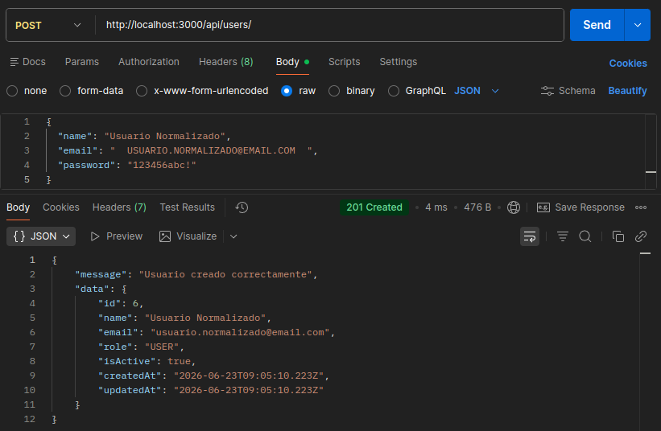
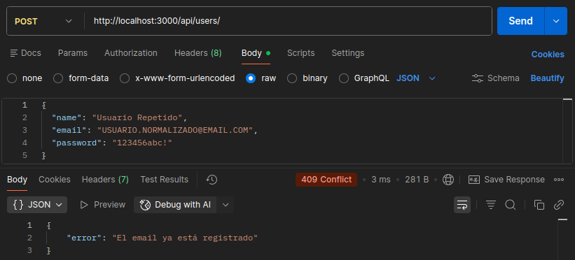
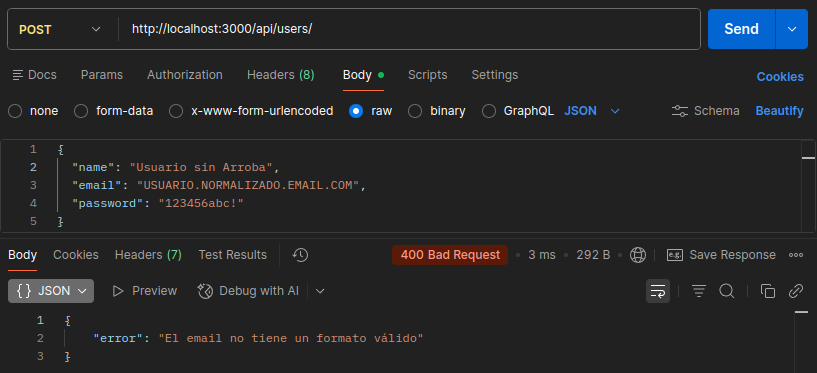
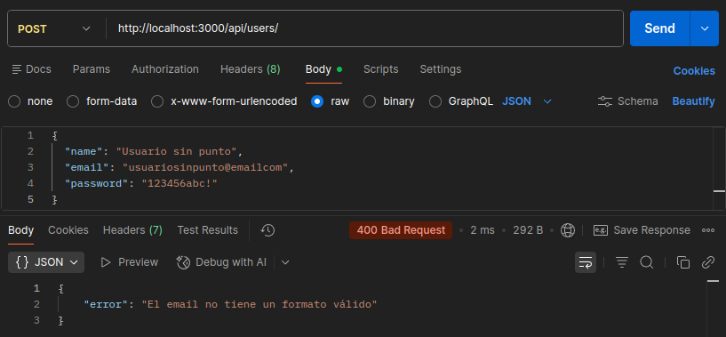
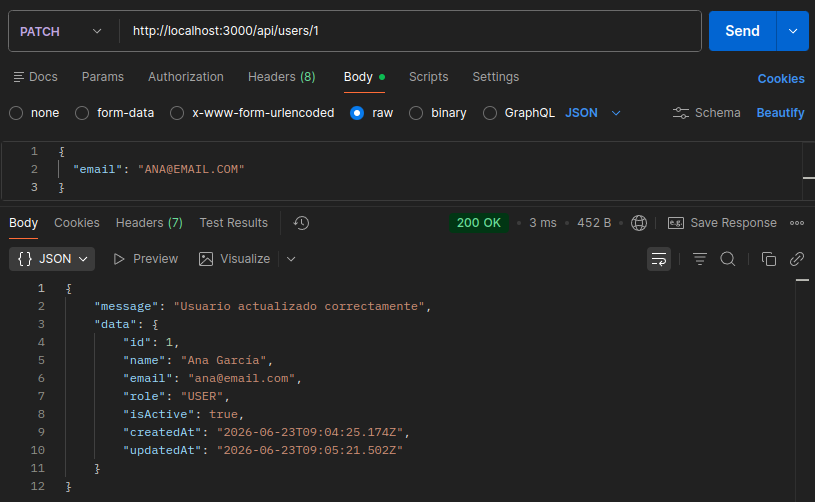
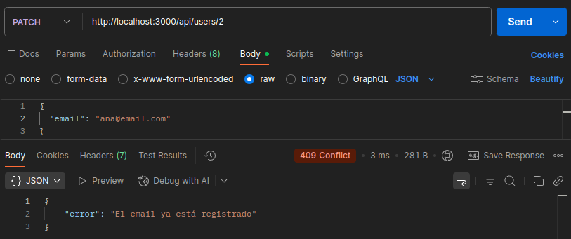
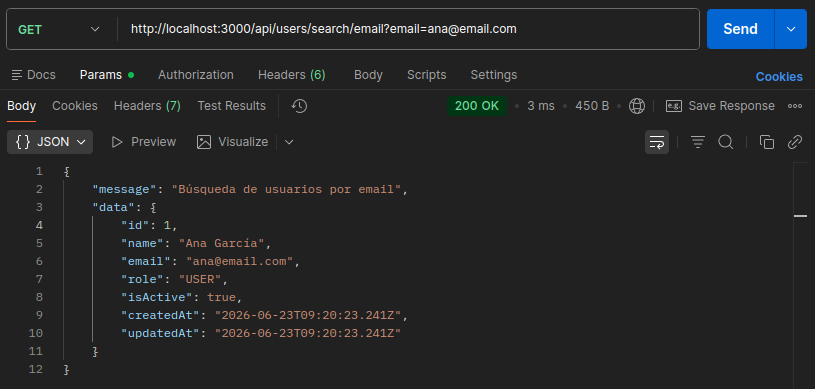
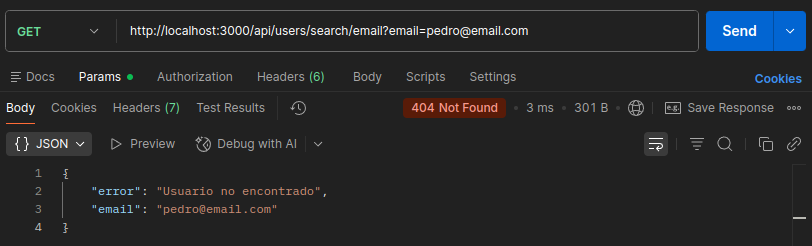

# Día 13 - Validación de email y control de duplicados

## Qué he hecho

- He creado una función para normalizar emails.
- He creado una función para validar emails de forma básica.
- He creado una función para comprobar si un email ya está registrado.
- He mejorado la creación de usuarios.
- He mejorado la actualización de usuarios.
- He comprobado duplicados en `POST /api/users`.
- He comprobado duplicados en `PATCH /api/users/:id`.
- He probado errores `400` y `409`.
- He creado un endpoint para buscar usuario por email `/api/users/search/email`

## Funciones creadas

```ts
function normalizeEmail(email: string): string {
  return email.trim().toLowerCase();
}

function isValidBasicEmail(value: string): boolean {
  const emailRegex = /^[a-zA-Z0-9.!#$%&'*+/=?^_`{|}~-]+@[a-zA-Z0-9-]+(?:\.[a-zA-Z0-9-]+)+$/;
  
  return emailRegex.test(value);
}

function isEmailTaken(email: string, userIdToIgnore?: number): boolean {
  const normalizedEmail = normalizeEmail(email);

  return users.some(
    (user) => user.email === normalizedEmail && user.id !== userIdToIgnore
  );
}
```

## Casos probados

| Caso | Código esperado | Resultado |
| --- | ---: | --- |
| Crear usuario con email normalizado | 201 | Aparece un mensaje de confirmación indicando que el usuario se ha creado correctamente y aparece el email normalizado |
| Crear usuario con email duplicado | 409 | Aparece un mensaje de error indicando que el email del nuevo usuario ya está registrado |
| Crear usuario con email sin @ | 400 | Aparece un mensaje de error indicando que el email no tiene un formato válido |
| Crear usuario con email sin punto | 400 | Aparece un mensaje de error indicando que el email no tiene un formato válido |
| Actualizar usuario con su mismo email | 200 | Aparece un mensaje de confirmación indicando que se han realizado los cambios correctamente |
| Actualizar usuario con email de otro usuario | 409 | Aparece un mensaje de error indicando que el email del nuevo usuario ya está registrado |
| Buscar usuario por email | 200 | Aparece un mensaje con la información del usuario del email buscado |
| Buscar usuario por email que no existe | 404 | Aparece un mensaje de error indicando que no existe ningún usuario con el email buscado |

### Prueba con POSTMAN - POST http://localhost:3000/api/users normalizando email


### Prueba con POSTMAN - POST http://localhost:3000/api/users email repetido


### Prueba con POSTMAN - POST http://localhost:3000/api/users email sin arroba


### Prueba con POSTMAN - POST http://localhost:3000/api/users email sin punto


### Prueba con POSTMAN - PATCH http://localhost:3000/api/users/1 mismo email


### Prueba con POSTMAN - PATCH http://localhost:3000/api/users/2 email repetido


### Prueba con POSTMAN - GET http://localhost:3000/api/users/search/email?email=ana@email.com


### Prueba con POSTMAN - GET http://localhost:3000/api/users/search/email?email=pedro@email.com


## Explicación personal

Normalizar un email significa limpiarlo antes de guardarlo o compararlo. En este proyecto usamos `trim` y `toLowerCase` para evitar duplicados provocados por espacios o mayúsculas.

## 409 Conflict
El código HTTP 409 Conflict indica que una petición no puede procesarse porque entra en conflicto con el estado actual del servidor o la base de datos. Lo utilizamos al intentar registrar un usuario con un email duplicado porque choca directamente con la restricción de unicidad de nuestro sistema; en este escenario no es adecuado devolver un error 400 Bad Request, ya que la petición en sí misma y el formato de los datos enviados son totalmente correctos y válidos, siendo el problema exclusivamente una colisión con un registro ya existente.

## Normalización de datos
Normalizar un email consiste en limpiar y estandarizar su formato de texto antes de guardarlo en la base de datos, habitualmente eliminando espacios accidentales en los extremos y convirtiendo todo a minúsculas. Si guardásemos los correos exactamente tal como llegan del cliente, el sistema interpretaría que cadenas de texto como `"ANA@EMAIL.COM"`, `"ana@email.com"` y `"  ana@email.com "` son tres direcciones completamente distintas. Aplicar esta normalización evita graves problemas de lógica, como permitir que se creen cuentas duplicadas con el mismo correo real o generar errores de inicio de sesión si el usuario introduce su email con variaciones de mayúsculas o espacios en blanco.