# Día 14 - Códigos de estado HTTP

## Qué he hecho

- He revisado los códigos HTTP utilizados en la API.
- He probado respuestas correctas con `200 OK`.
- He probado creación con `201 Created`.
- He probado errores de validación con `400 Bad Request`.
- He probado usuario inexistente con `404 Not Found`.
- He probado email duplicado con `409 Conflict`.
- He comprobado que el código HTTP coincide con el mensaje JSON.

## Tabla resumen

| Código | Significado | Cuándo lo uso |
| ---: | --- | --- |
| 200 | OK | Cuando la petición se procesa correctamente |
| 201 | Created | Cuando se crea un usuario |
| 400 | Bad Request | Cuando la petición tiene datos incorrectos |
| 404 | Not Found | Cuando el usuario no existe |
| 409 | Conflict | Cuando el email ya está registrado |

## Casos probados

| Petición | Caso | Código esperado | Código obtenido | ¿Correcto? |
| --- | --- | ---: | ---: | --- |
| `GET /api/health` | Health | 200 | 200 | ✅ |
| `GET /api/users` | Listado | 200 | 200 | ✅ |
| `GET /api/users/1` | Usuario existente | 200 | 200 | ✅ |
| `GET /api/users/999` | Usuario inexistente | 404 | 404 | ✅ |
| `GET /api/users/abc` | ID no válido | 400 | 400 | ✅ |
| `POST /api/users` | Creación correcta | 201 | 201 | ✅ |
| `POST /api/users` | Datos inválidos | 400 | 400 | ✅ |
| `POST /api/users` | Email duplicado | 409 | 409 | ✅ |
| `PATCH /api/users/1` | Actualización correcta | 200 | 200 | ✅ |
| `PATCH /api/users/abc` | ID no válido | 400 | 400 | ✅ |
| `PATCH /api/users/999` | Usuario inexistente | 404 | 404 | ✅ |
| `PATCH /api/users/1` | Body vacío | 400 | 400 | ✅ |
| `PATCH /api/users/2` | Email duplicado | 409 | 409 | ✅ |
| `DELETE /api/users/1` | Desactivación correcta | 200 | 200 | ✅ |
| `DELETE /api/users/abc` | ID  no válido | 400 | 400 | ✅ |
| `DELETE /api/users/999` | Usuario inexistente | 404 | 404 | ✅ |

### Prueba con POSTMAN - GET http://localhost:3000/api/health 200 OK
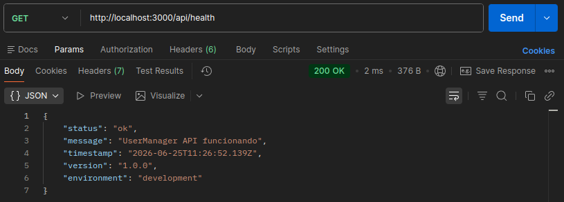

### Prueba con POSTMAN - GET http://localhost:3000/api/users 200 OK
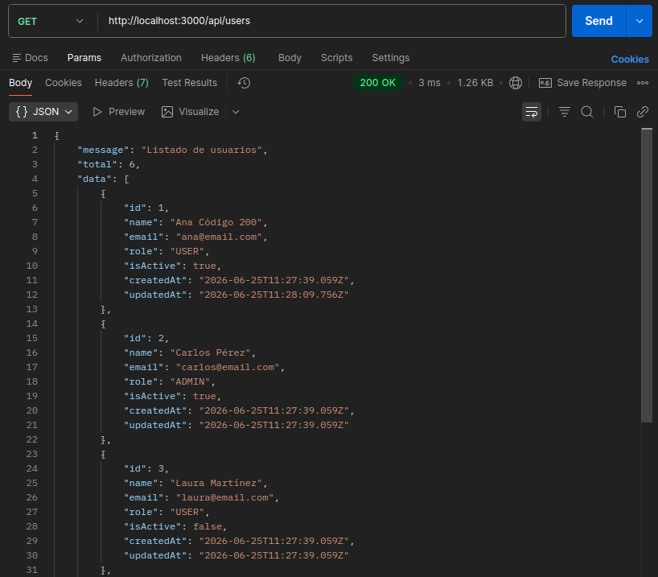

### Prueba con POSTMAN - GET http://localhost:3000/api/users/1 200 OK
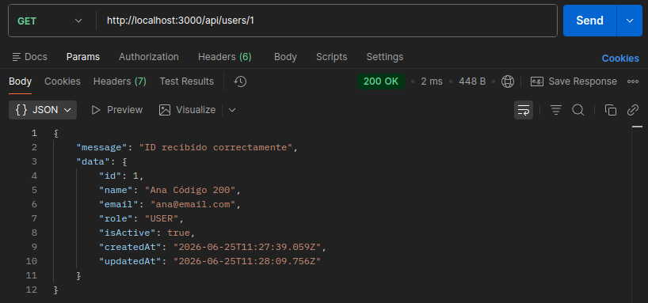

### Prueba con POSTMAN - GET http://localhost:3000/api/users/999 404 Not Found

### Prueba con POSTMAN - GET http://localhost:3000/api/users/abc 200 Bad Request

### Prueba con POSTMAN - POST http://localhost:3000/api/users 201 Created
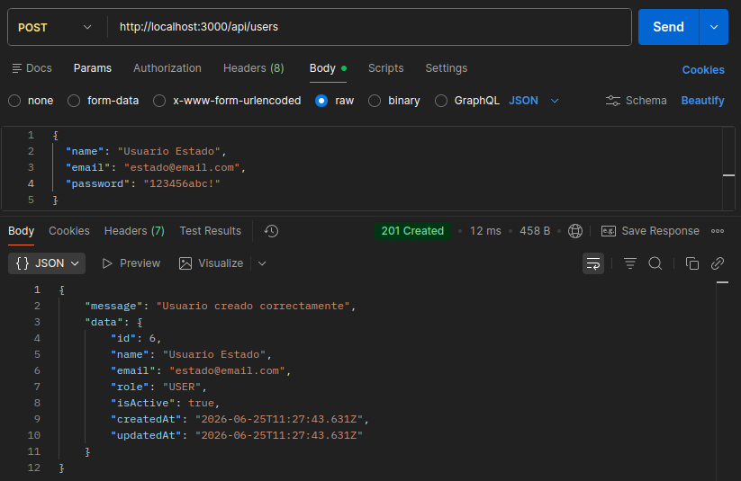

### Prueba con POSTMAN - POST http://localhost:3000/api/users 400 Bad Request
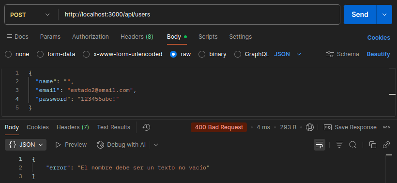

### Prueba con POSTMAN - POST http://localhost:3000/api/users 409 Conflict
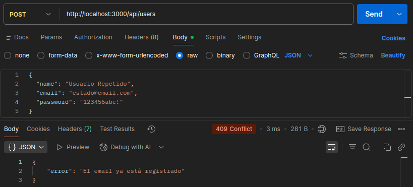

### Prueba con POSTMAN - PATCH http://localhost:3000/api/users/1 200 OK
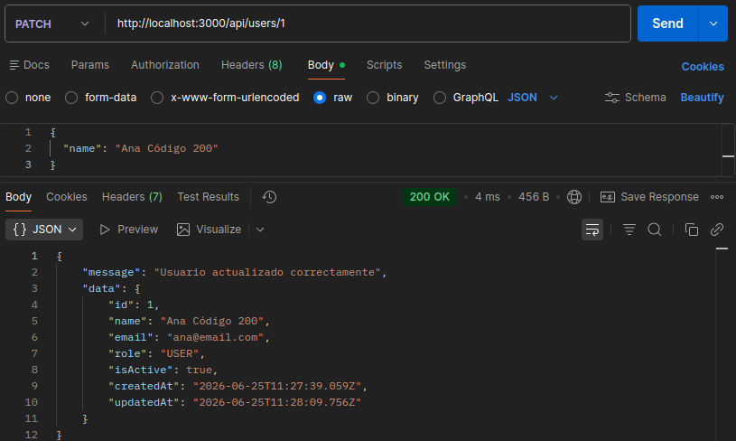

### Prueba con POSTMAN - PATCH http://localhost:3000/api/users/abc 400 Bad Request

### Prueba con POSTMAN - PATCH http://localhost:3000/api/users/999 404 Not Found
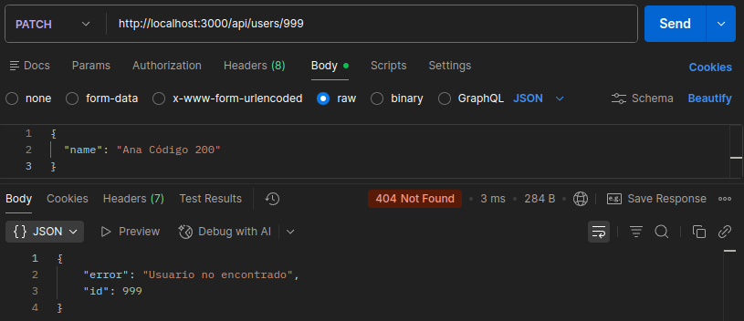

### Prueba con POSTMAN - PATCH http://localhost:3000/api/users/1 400 Bad Request
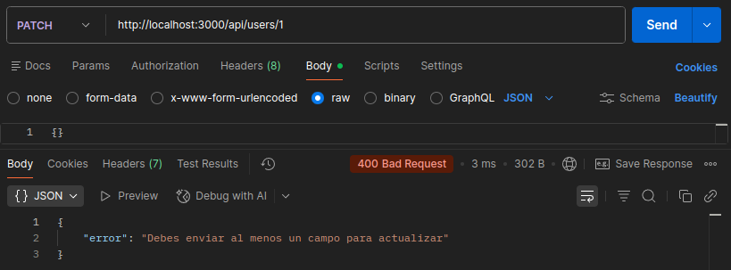

### Prueba con POSTMAN - PATCH http://localhost:3000/api/users/2 409 Conflict
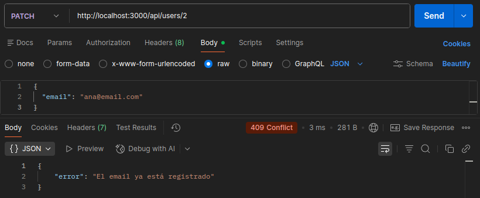

### Prueba con POSTMAN - DELETE http://localhost:3000/api/users/1 200 OK
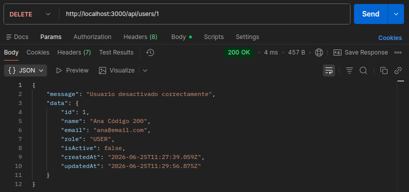

### Prueba con POSTMAN - DELETE http://localhost:3000/api/users/abc 400 Bad Request
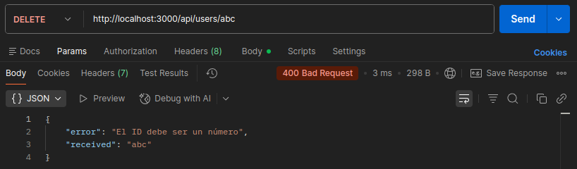

### Prueba con POSTMAN - DELETE http://localhost:3000/api/users/999 404 Not Found
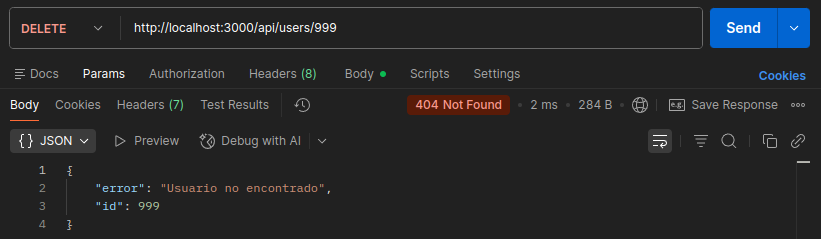

## Explicación personal

Los códigos de estado HTTP permiten que el cliente entienda rápidamente qué ha pasado con una petición. No basta con devolver un JSON; el código HTTP también debe ser coherente con el resultado.

## Cómo decido qué código usar

| Situación | Código que usaría | Motivo |
| ---: | --- | --- |
| Usuario creado correctamente | 201 Created | La petición ha tenido éxito y se ha creado un nuevo recurso en el servidor |
| Usuario no encontrado | 404 Not Found | El recurso buscado no se ha encontrado |
| ID no numérico | 400 Bad Request | El cliente ha enviado datos con formato o tipo no válido |
| Email duplicado | 409 Conflict | La petición entra en conflicto con el estado actual del servidor |
| Falta un campo obligatorio | 400 Bad Request | Faltan datos necesarios para poder procesar la solicitud |
| Usuario actualizado correctamente | 200 Ok | La petición ha tenido éxito y devuelve el recurso modificado |

## Diferencia entre 400, 404 y 409

La diferencia principal entre estos tres códigos de estado radica en la naturaleza del error detectado al procesar la petición en la API. Un código `400 Bad Request` indica un problema de sintaxis o de validación por parte del cliente, como ocurre al enviar una petición `POST http://localhost:3000/api/users/1` con el cuerpo completamente vacío, lo que impide al servidor procesar los datos obligatorios. Por otro lado, el `404 Not Found` se utiliza cuando la solicitud es formalmente correcta pero el recurso específico no existe en el servidor, lo cual se ejemplifica al realizar un `GET http://localhost:3000/api/users/999` si dicho identificador no corresponde a ningún usuario registrado. Finalmente, el `409 Conflict` responde a un problema de lógica de negocio donde la petición entra en conflicto con el estado actual del servidor; esto se observa claramente al ejecutar un `PATCH http://localhost:3000/api/users/2` e intentar cambiar el correo en el cuerpo a `{email: "ana@email.com"}`, lo que genera un conflicto si ese email ya está duplicado y registrado por otro usuario en el sistema, violando así las restricciones de unicidad de los datos.

## Breve explicación de 401 y 403

La diferencia fundamental entre estos dos códigos de estado radica en si la identidad del usuario es conocida y si esta cuenta con los privilegios necesarios para acceder al recurso. El código `401 Unauthorized` se utiliza específicamente cuando no existe una autenticación válida o las credenciales proporcionadas son incorrectas, lo que significa que el servidor no puede identificar quién está realizando la solicitud (un escenario típico de cuando falta un token JWT o este ha expirado). Por el contrario, el `403 Forbidden` se aplica cuando el usuario ya ha sido correctamente autenticado e identificado por el sistema, pero su cuenta no posee los permisos, privilegios o roles requeridos para realizar la acción solicitada (por ejemplo, un usuario autenticado con un rol básico que intenta acceder a un endpoint exclusivo de administración).