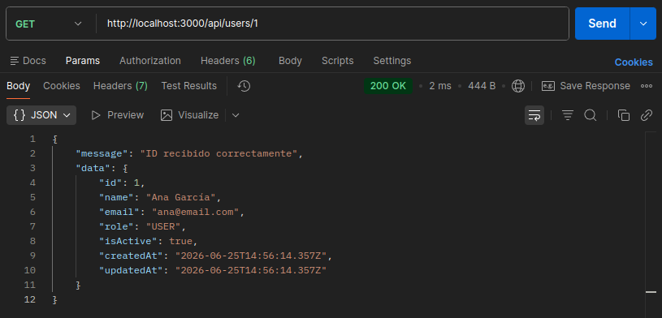
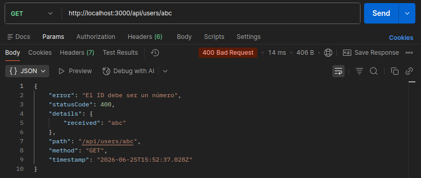
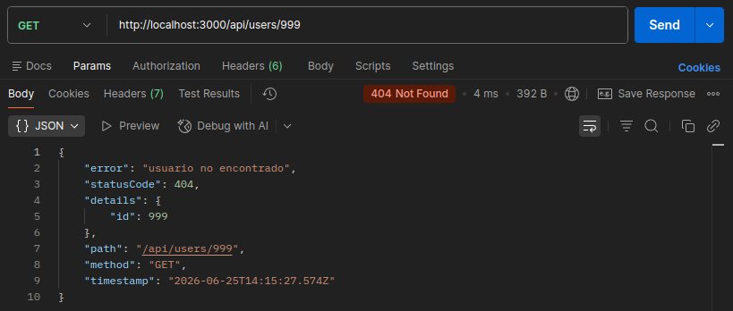
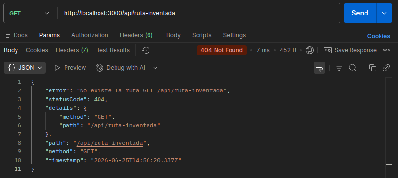
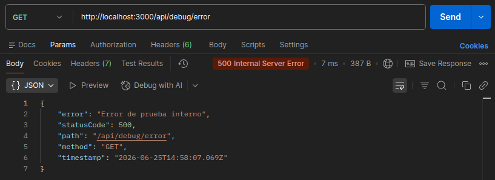

# Día 15 - Middleware centralizado de errores

## Qué he hecho

- He aprendido qué es un middleware.
- He aprendido para qué sirve `next()`.
- He creado una clase `AppError`.
- He creado un middleware para rutas no encontradas.
- He creado un middleware global de errores.
- He adaptado `GET /api/users/:id` para usar `next(new AppError(...))`.
- He probado errores `400`, `404` y `500`.
- He comprobado que los errores tienen un formato común.
- He adaptado el resto de endpoints para usar `next(new AppError(...))`

## Clase AppError

```ts
class AppError extends Error {
  statusCode: number;
  details?: unknown;

  constructor(message: string, statusCode: number = 500, details?: unknown) {
    super(message);
    this.statusCode = statusCode;
    this.details = details;
  }
}
```

## Formato de error

```json
{
  "error": "Mensaje del error",
  "statusCode": 400,
  "details": {},
  "path": "/api/users/abc",
  "method": "GET",
  "timestamp": "..."
}
```

## Casos probados

| Petición | Caso | Código esperado | Resultado |
| --- | --- | ---: | --- |
| `GET /api/users/1` | Usuario existente | 200 | Aparece un mensaje de confirmación con la información del usuario |
| `GET /api/users/abc` | ID no válido | 400 | Aparece el mensaje de error del middleware global de errores con los detalles del error |
| `GET /api/users/999` | Usuario no encontrado | 404 | Aparece el mensaje de error del middleware global de errores con los detalles del error |
| `GET /api/ruta-inventada` | Ruta inexistente | 404 | Aparece el mensaje de error del middleware para rutas no encontradas con los detalles del error |
| `GET /api/debug/error` | Error interno de prueba | 500 | Aparece el mensaje de error del middleware global de errores con los detalles del error |

### Prueba con POSTMAN - GET http://localhost:3000/api/users/1


### Prueba con POSTMAN - GET http://localhost:3000/api/users/abc


### Prueba con POSTMAN - GET http://localhost:3000/api/users/999


### Prueba con POSTMAN - GET http://localhost:3000/api/ruta-inventada


### Prueba con POSTMAN - GET http://localhost:3000/api/debug/error


## Explicación personal

Un middleware de errores permite centralizar la forma en que la API responde cuando ocurre un problema. Así evitamos que cada ruta devuelva errores con formatos diferentes.

## Orden de los middlewares

En Express, el orden de declaración del código es fundamental porque las peticiones se evalúan secuencialmente de arriba hacia abajo. Si colocáramos el middleware de error 404 o el manejador global de errores antes de las rutas, actuarían como una barrera prematura, provocando que las peticiones llegaran al middleware de error y fueran rechazadas antes de tener siquiera la oportunidad de encontrar su endpoint correcto. Por lo tanto, estos middlewares deben situarse siempre al final del archivo para actuar como una red de seguridad; de esta forma, solo atrapan y gestionan aquellas solicitudes que han ido "cayendo" por el código al no coincidir con ninguna ruta válida o al haber sufrido algún fallo durante su ejecución.