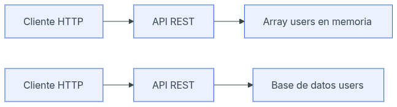

# Día 16 - Base de datos y persistencia

## Qué he hecho

- He comprobado que los datos en memoria se pierden al reiniciar el servidor.
- He entendido qué significa persistencia.
- He comparado datos en memoria y base de datos.
- He diseñado la tabla users.
- He definido campos, tipos conceptuales y restricciones.
- He escrito una propuesta SQL conceptual.
- He explicado cómo cambiará la arquitectura del proyecto.

## Problema detectado

Al crear un usuario en memoria y reiniciar el servidor, el usuario desaparece.

Esto ocurre porque los datos están guardados dentro del proceso de Node.js y no
en una base de datos persistente.

## Cambio de arquitectura



## Diseño de la tabla users

| Campo TypeScript | Campo en base de datos | Tipo conceptual | Descripción |
| --- | --- | --- | --- |
| `id` | `id` | número | Identificador único |
| `name` | `name` | texto | Nombre del usuario |
| `email` | `email` | texto | Email único |
| `passwordHash` | `password_hash` | texto | Contraseña hasheada |
| `role` | `role` | texto | USER o ADMIN |
| `isActive` | `is_active` | booleano | Estado del usuario |
| `createdAt` | `created_at` | fecha | Fecha de creación |
| `updatedAt` | `updated_at` | fecha | Fecha de modificación |
| `lastLoginAt` | `last_login_at` | fecha | Fecha de última conexión |
| `avatarUrl` | `avatar_url` | texto | Url de la imagen del avatar |
| `phone` | `phone` | texto | Número de teléfono |
| `bio` | `bio` | texto | Pequeña biografía del usuario |

## Diseño de restricciones

| Campo | Restricción | Motivo |
| :--- | :--- | :--- |
| `id` | PRIMARY KEY | Identifica cada usuario |
| `name` | NOT NULL | Todo usuario debe tener nombre |
| `email` | NOT NULL, UNIQUE | Todo usuario debe tener email y no se puede repetir |
| `password_hash` | NOT NULL | Todo usuario necesita credenciales |
| `role` | NOT NULL | Todo usuario debe tener un rol |
| `is_active` | NOT NULL, DEFAULT true | Todo usuario debe tener estado |
| `created_at` | NOT NULL | Debe registrarse cuándo se creó |
| `updated_at` | NOT NULL | Debe registrarse cuándo se modificó |
| `last_login_at` | NOT NULL | Debe registrarse cuándo se conectó por última vez |
| `avatar_url` | NOT NULL, DEFAULT url_default | Si el usuario no elige una imagen de perfil se le aplica una por defecto |
| `phone` | NULLABLE, UNIQUE | El usuario puede elegir poner su teléfono o no |
| `bio` | NULLABLE | El usuario puede elegir poner su bio o no |

## Propuesta SQL conceptual

```sql
CREATE TABLE users (
  id SERIAL PRIMARY KEY,
  name VARCHAR(100) NOT NULL,
  email VARCHAR(150) NOT NULL UNIQUE,
  password_hash VARCHAR(255) NOT NULL,
  role VARCHAR(20) NOT NULL,
  is_active BOOLEAN NOT NULL DEFAULT true,
  created_at TIMESTAMP NOT NULL DEFAULT CURRENT_TIMESTAMP,
  updated_at TIMESTAMP NOT NULL DEFAULT CURRENT_TIMESTAMP,
  last_login_at TIMESTAMP NOT NULL DEFAULT CURRENT_TIMESTAMP,
  avatar_url VARCHAR(512) NOT NULL DEFAULT 'https://url_de_avatar_por_defecto'
  phone VARCHAR(50) NULL UNIQUE,
  bio VARCHAR(500) NULL
);
```

## Explicación personal

Necesitamos una base de datos porque los datos en memoria se pierden cuando se reinicia el servidor. Una base de datos permite guardar la información de forma persistente y recuperarla más adelante.

## ¿Qué es la persistencia?

La persistencia es la capacidad de almacenar información de forma permanente. En la práctica, esto significa que los datos se conservan intactos de manera segura y siguen estando disponibles aunque la aplicación se cierre, el servidor se apague o el sistema se reinicie. Básicamente, es el mecanismo que evita que la información se pierda cuando dejas de usar un programa.

## Tabla comparativa entre memoria y base de datos

| Aspecto | Memoria | Base de datos |
| :--- | :--- | :--- |
| ¿Los datos se conservan al reiniciar? | No | Sí |
| ¿Sirve para pruebas iniciales? | Sí | Sí |
| ¿Sirve para una aplicación real? | No | Sí |
| ¿Permite trabajar con muchos datos? | No (Depende de la RAM) | Sí (Grandes volúmenes) |
| ¿Permite restricciones como UNIQUE? | No (Hay que programarlo) | Sí (De forma nativa) |

## Independencia entre API y base de datos

El cliente (ya sea una página web o una aplicación móvil) no necesita conocer cómo se guarda la información internamente, ya que únicamente se comunica con la API consumiendo rutas y recibiendo respuestas en formato JSON. Mientras la API mantenga este "contrato" y devuelva los datos con la estructura esperada, el origen interno de la información puede cambiar perfectamente de un array temporal en memoria a una base de datos real sin que el cliente lo note ni necesite ser modificado.