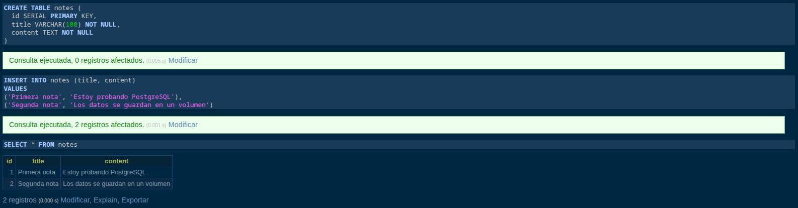
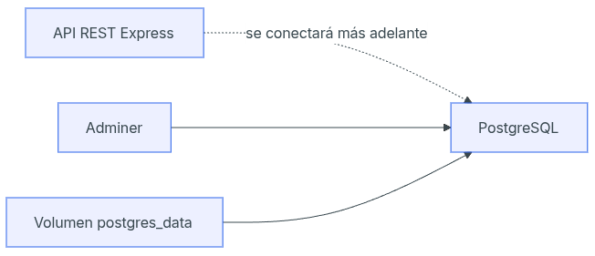

# Día 17 - PostgreSQL con Docker Compose

## Qué he hecho

- He comprobado que Docker está instalado.
- He creado un archivo `docker-compose.yml`.
- He levantado un servicio PostgreSQL.
- He levantado un servicio Adminer.
- He accedido a Adminer desde el navegador.
- He creado una tabla de prueba.
- He insertado un dato de prueba.
- He comprobado la persistencia usando un volumen.

## Servicios creados

| Servicio | Imagen | Puerto | Función |
| --- | --- | --- | --- |
| postgres | postgres:16 | 5432 | Base de datos PostgreSQL |
| adminer | adminer:latest | 8080 | Interfaz web para consultar la base de datos |

## Datos de conexión

| Campo | Valor |
| --- | --- |
| Sistema | PostgreSQL |
| Servidor | postgres |
| Usuario | usermanager |
| Contraseña | usermanager_password |
| Base de datos | usermanager_db |

## Comandos usados

```bash
docker compose up -d
docker ps
docker compose ps
docker compose down
```

## Prueba de conexión

```sql
CREATE TABLE test_connection (
  id SERIAL PRIMARY KEY,
  message VARCHAR(100) NOT NULL
);

INSERT INTO test_connection (message)
VALUES ('PostgreSQL funciona correctamente');

SELECT * FROM test_connection;
```

## Explicación personal

Docker Compose permite levantar la base de datos y otras herramientas necesarias
usando un único archivo de configuración. Gracias al volumen, los datos de
PostgreSQL se conservan aunque paremos y volvamos a arrancar los contenedores.

## Explicación del docker-compose.yml

Este archivo `docker-compose.yml` define y coordina los dos servicios necesarios para el entorno de datos de nuestra aplicación: la base de datos (postgres) y un gestor web para visualizarla (adminer).

A continuación se explica el propósito de cada una de las etiquetas utilizadas:

- **services**: Es el nodo principal donde se definen los contenedores que se van a levantar. En nuestro caso, agrupa los dos servicios de la aplicación: `postgres` y `adminer`.

- **image**: Especifica la plantilla oficial y la versión que se descargará de Docker Hub para crear cada contenedor. Aquí utilizamos `postgres:16` para la base de datos y `adminer:latest` para la interfaz web.

- **container_name**: Asigna un nombre fijo y personalizado a cada contenedor (`usermanager_postgres` y `usermanager_adminer`). Esto facilita identificarlos y gestionarlos desde la terminal en lugar de usar nombres aleatorios.

- **environment**: Define las variables de entorno para configurar el contenedor por dentro. En el servicio de Postgres, se usa para establecer de forma segura el usuario, la contraseña y el nombre de la base de datos inicial (`usermanager_db`).

- **ports**: Mapea los puertos del contenedor con los de nuestra máquina local (`máquina:contenedor`). Permite que nuestra API REST conecte con la base de datos a través del puerto `5432`, y que nosotros podamos acceder visualmente a Adminer desde el navegador web mediante el puerto `8080`.

- **volumes**: Se encarga de la persistencia de datos. Vincula el volumen de Docker `postgres_data` con la ruta interna donde PostgreSQL guarda la información. Así, aunque los contenedores se apaguen o se destruyan, los datos guardados en la base de datos no se perderán.

- **depends_on**: Establece un orden de arranque y una jerarquía. Indica que el servicio `adminer` depende de `postgres`, por lo que Docker se asegurará de levantar primero el contenedor de la base de datos antes de iniciar la interfaz web de gestión.


## Creación y prueba de la tabla `notes`

A través de la interfaz web de Adminer, nos conectamos a nuestra base de datos PostgreSQL y ejecutamos una sentencia SQL para crear una tabla llamada `notes` con tres campos: un identificador único que se autoincrementa (`id`), un título (`title`) y el cuerpo de la nota (`content`). Posteriormente, insertamos dos registros de prueba con contenido de ejemplo y realizamos una consulta general (`SELECT *`) para verificar la tabla.

```sql
CREATE TABLE notes (
  id SERIAL PRIMARY KEY,
  title VARCHAR(100) NOT NULL,
  content TEXT NOT NULL
);

INSERT INTO notes (title, content)
VALUES
('Primera nota', 'Estoy probando PostgreSQL'),
('Segunda nota', 'Los datos se guardan en un volumen');

SELECT * FROM notes;
```

- **Validación del entorno**: Confirmamos que la comunicación entre el contenedor de Adminer y el de PostgreSQL funciona de manera correcta.
- **Persistencia y estructura**: Comprobamos que la base de datos es capaz de estructurar la información, almacenar los registros introducidos y devolverlos correctamente al consultarlos.

### Ejemplo en Adminer de la tabla `notes`


## Diferencia entre 'docker compose down' y 'docker compose down -v'

Para entender el comportamiento de nuestro entorno, es fundamental conocer cómo gestiona Docker el apagado de los servicios:

* **`docker compose down`:** Detiene y elimina los contenedores (`usermanager_postgres` y `usermanager_adminer`) y las redes creadas por el archivo, pero **mantiene intactos los datos**. El volumen de la base de datos no se toca.
* **`docker compose down -v`:** Hace exactamente lo mismo, pero añade el flag `-v` (volumes), lo que significa que **elimina de forma permanente los volúmenes asociados**.

### ¿Qué pasaría si ejecutamos 'docker compose down -v'?

**Qué hacemos**:
Si ejecutamos este comando, Docker apagará y destruirá los contenedores de Postgres y Adminer, y acto seguido **borrará el volumen `postgres_data`** de nuestro sistema.

**Qué ocurre**:
* **Pérdida total de datos**: Al destruir el volumen, la tabla `notes` que acabamos de crear y las dos notas que hemos insertado se borrarán por completo.
* **Reinicio limpio**: La próxima vez que levantemos el entorno con `docker compose up`, PostgreSQL iniciará completamente vacío, como si lo instaláramos por primera vez, obligándonos a crear la estructura de datos desde cero.

## Diagrama de Arquitectura Actual



El diagrama representa la estructura y el flujo de comunicación de nuestro entorno de desarrollo actual, detallando cómo interactúan los componentes definidos en Docker y los que se integrarán en el futuro:

* **Adminer ──> PostgreSQL**: Representa la conexión actual que hemos probado. Indica que el gestor web Adminer tiene acceso directo al contenedor de la base de datos PostgreSQL, lo que nos ha permitido crear la tabla `notes` e insertar registros de forma visual.
* **Volumen postgres_data ──> PostgreSQL**: Muestra la relación de persistencia. El volumen está conectado directamente a PostgreSQL para almacenar de forma segura todos los archivos físicos de la base de datos, garantizando que la información no se pierda al apagar los contenedores.
* **API REST Express ┄┄> PostgreSQL**: Representa la siguiente fase del proyecto. La línea discontinua con el texto *"se conectará más adelante"* indica que nuestra aplicación backend (desarrollada en Express) está contemplada en la arquitectura, pero su conexión con la base de datos se implementará en pasos posteriores del trabajo.