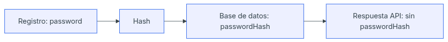
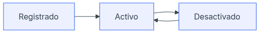

# Día 18 - Diseño del modelo persistente User

## Qué he hecho

- He analizado qué datos necesita guardar un usuario.
- He diferenciado entre usuario en memoria y usuario persistente.
- He definido los campos principales del modelo User.
- He identificado qué campos son obligatorios.
- He identificado qué campos deben ser únicos.
- He marcado passwordHash como dato sensible.
- He definido las reglas de role e isActive.
- He preparado el diseño para convertirlo más adelante en un modelo Prisma.

## Campos del modelo User

| Campo | Tipo conceptual | Obligatorio | Único | Valor por defecto | Se devuelve al cliente |
| :--- | :--- | :--- | :--- | :--- | :--- |
| `id` | número | sí | sí | automático | sí |
| `name` | texto | sí | no | no | sí |
| `email` | texto | sí | sí | no | sí |
| `passwordHash` | texto | sí | no | no | no |
| `role` | `USER` / `ADMIN` | sí | no | `USER` | sí |
| `isActive` | booleano | sí | no | `true` | sí |
| `createdAt` | fecha | sí | no | automático | sí |
| `updatedAt` | fecha | sí | no | automático | sí |
| `lastLoginAt` | fecha | sí | no | automático | sí |
| `avatarUrl` | texto | sí | no | `url_default` | sí |
| `phone` | texto | no | sí | no | sí |
| `bio` | texto | no | no | no | sí |

## Reglas del modelo

- El email no se puede repetir.
- El email debe guardarse normalizado.
- La contraseña nunca se guarda en texto plano.
- `passwordHash` nunca se devuelve al cliente.
- Todo usuario tiene un rol.
- El rol por defecto es `USER`.
- Todo usuario se crea activo.
- Un usuario desactivado no puede iniciar sesión.
- `createdAt` se genera al crear el usuario.
- `updatedAt` cambia cuando el usuario se modifica.
- `lastLoginAt` cambia cada vez que el usuario se conecta.
- `avatarUrl` tiene por defecto una URL de una imagen predefinida.
- `phone` no se puede repetir

## Entrada, persistencia y salida

| Representación | Qué significa | Contiene password | Contiene passwordHash |
| :--- | :--- | :--- | :--- |
| Entrada | Datos que envía el cliente | sí | no |
| Persistencia | Datos guardados en base de datos | no | sí |
| Salida | Datos que devuelve la API | no | no |

### Ejemplo de entrada

```json
{
  "name": "Ana García",
  "email": "ana@email.com",
  "password": "123456"
}
```

### Ejemplo de salida

```json
{
  "id": 1,
  "name": "Ana García",
  "email": "ana@email.com",
  "role": "USER",
  "isActive": true,
  "createdAt": "...",
  "updatedAt": "..."
}
```

## Posible modelo Prisma futuro

```prisma
model User {
  id           Int      @id @default(autoincrement())
  name         String
  email        String   @unique
  passwordHash String
  role         Role     @default(USER)
  isActive     Boolean  @default(true)
  createdAt    DateTime @default(now())
  updatedAt    DateTime @updatedAt
  lastLoginAt  DateTime @lastLoginAt
  avatarUrl    String   @default("url_default")
  phone        String   @unique
  bio          String
}

enum Role {
  USER
  ADMIN
}
```

Este modelo todavía no se implementa hoy. Servirá como referencia para los próximos días.

## Diagrama de flujo

La contraseña llega desde el cliente solo durante el registro o login. Después se transforma en un hash y se guarda como passwordHash. La API nunca debe devolver password ni passwordHash.



## Por qué guardamos passwordHash y no password

Guardar las contraseñas en texto plano (`password`) supone un riesgo crítico de seguridad en caso de una filtración de datos; por ello, guardamos el `passwordHash`, que es el resultado de aplicar una función matemática unidireccional e irreversible. Al ser un proceso que no se puede "desencriptar" ni revertir para recuperar la contraseña original, el sistema simplemente compara el hash generado al iniciar sesión con el almacenado en la base de datos para validar el acceso. De esta forma, protegemos la privacidad de los usuarios y garantizamos que sus contraseñas reales permanezcan completamente seguras y segurizadas, incluso ante un eventual incidente de seguridad.

## Permisos por rol

| Acción | USER | ADMIN |
| :--- | :---: | :---: |
| Ver su perfil | sí | sí |
| Listar todos los usuarios | no | sí |
| Cambiar su nombre | sí | sí |
| Cambiar su rol | no | sí |
| Desactivar usuarios | no | sí |
| Cambiar su contraseña | sí | sí |

## Ciclo de vida del usuario

El ciclo de vida del usuario consta de tres estados principales y sus respectivas transiciones:

* **Registrado**: Es el estado inicial tras la creación de la cuenta. El usuario avanza de forma unidireccional hacia el estado activo (por ejemplo, tras confirmar su correo electrónico o ser aprobado).
* **Activo**: El usuario dispone de acceso completo y operativo a la plataforma.
* **Desactivado**: Estado de suspensión temporal. Un usuario activo puede ser deshabilitado (por infracción de normas, petición propia, etc.), existiendo una transición bidireccional que permite reactivar la cuenta y devolver al usuario al estado activo en cualquier momento.

---



## Dudas para elegir herramienta de acceso a datos

- ¿Qué herramienta se usa más con TypeScript?
- Cuál permite definir modelos de forma más clara?
- Cuál ayuda más a evitar errores?
- Cuál es más fácil de aprender?
- Si el proyecto crece y tenemos que hacer consultas SQL muy complejas, ¿la herramienta nos frena o nos ayuda?
- ¿Cómo gestiona cada herramienta las migraciones de la base de datos?